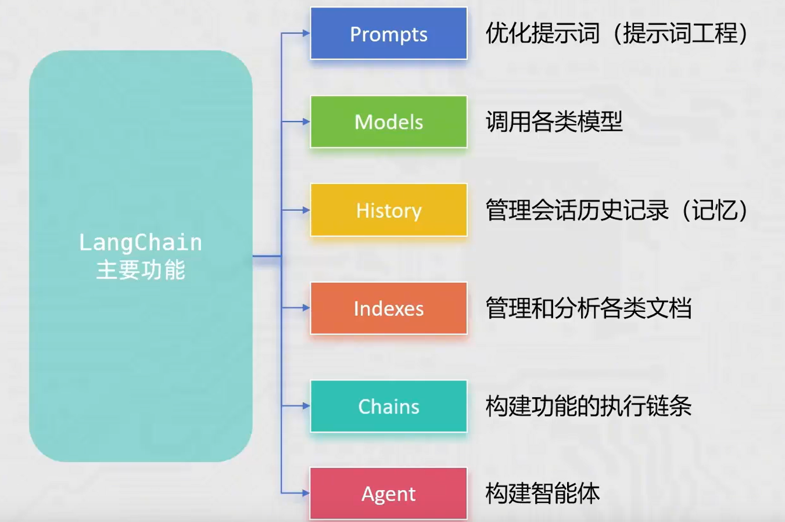
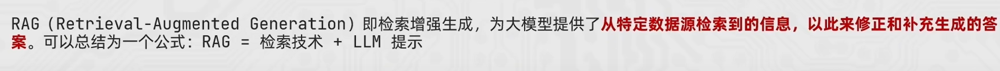
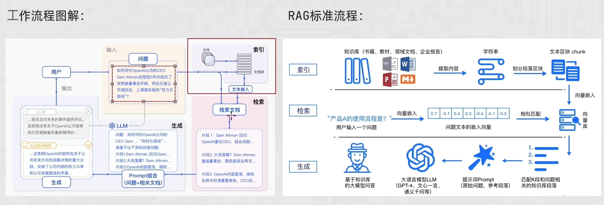
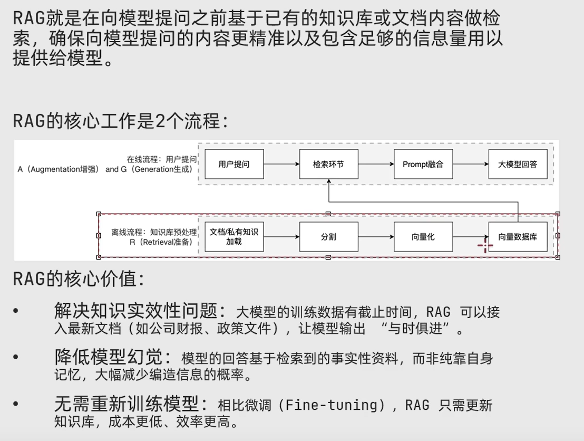
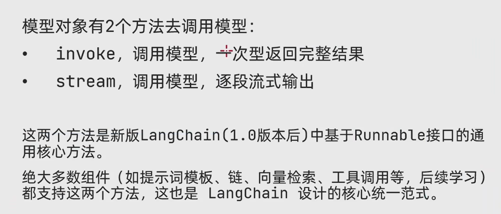
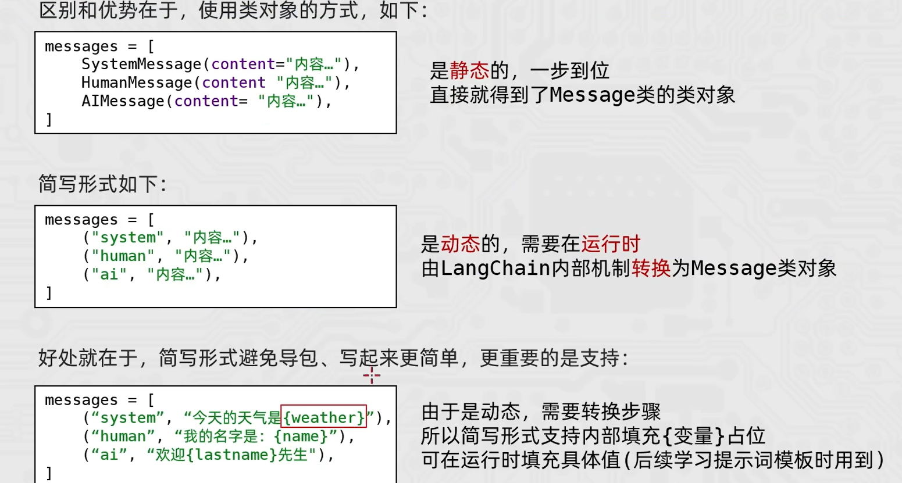
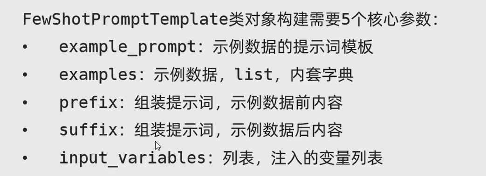

# LangChain 主要功能



# RAG



## RAG工作原理




## 工作流程  




## LangChain RAG开发


```python
# 调用阿里模型
from langchain_community.llms.tongyi import Tongyi

model = Tongyi(model="qwen-max", api_key='sk-xxx')

res = model.invoke(input="what is your name?")


print(res)

```


```python
# 调用本地ollama模型
from langchain_community.llms.ollama import Ollama
model = Ollama(model="deepseek-r1:7b")
res = model.invoke(input="what is your name?")
print(res)


# 流式输出
res = model.stream(input="你是谁?")
for chunk in res:
    print(chunk, end="", flush=True)
```




```python
# 调用本地ollama 聊天模型
# from langchain_community.chat_models.ollama import ChatOllama
# model = ChatOllama(model="deepseek-r1:7b")

# res = model.stream(input="你是谁?")
# for chunk in res:
#     print(chunk.content, end="", flush=True)


# 调用Qwen模型
from langchain_community.chat_models.tongyi import ChatTongyi
from langchain_core.messages import HumanMessage, SystemMessage, AIMessage
model = ChatTongyi(model="qwen3-max", api_key='sk-xx')

Messages = [
    SystemMessage(content="你是一个诗人"),
    HumanMessage(content="写一首唐诗"),
    AIMessage(content="床前明月光，疑是地上霜。举头望明月，低头思故乡。"),
    HumanMessage(content="再写一首宋词")
]

res = model.stream(input=Messages)
for chunk in res:
    print(chunk.content, end="", flush=True)
```





### 提示词模板

```python
from langchain_core.prompts import PromptTemplate
from langchain_community.llms.tongyi import Tongyi

model = Tongyi(model="qwen-max", api_key='sk-xx')
prompt = PromptTemplate.from_template(
    "姓{lastname}, {gender}, 帮我起个名字, 简略回答"
)
chain = prompt | model
res = chain.invoke({"lastname": "李", "gender": "女儿"})
print(res)
```


### FewShot提示词模板



```python
from sys import prefix
from langchain_core.prompts import FewShotPromptTemplate, PromptTemplate
from langchain_community.llms.tongyi import Tongyi
model = Tongyi(model="qwen-max", api_key='sk-xx')
example_prompt = PromptTemplate.from_template(
    "单词:{word}, 反义词:{antonym}"
)

examples = [
    {"word": "开心", "antonym": "伤心"},
    {"word": "高", "antonym": "矮"}
]

prompt = FewShotPromptTemplate(
    examples=examples, 
    example_prompt=example_prompt, 
    prefix='告知我单词的反义词, 我提供如下的示例:',
    suffix="告诉我单词:{word}的反义词:",  
    input_variables=["word"]
)

chain = prompt | model
res = chain.invoke({"word": "大"})
print(res)
```

