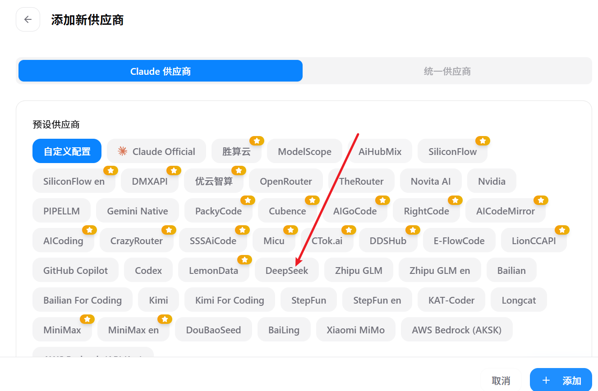
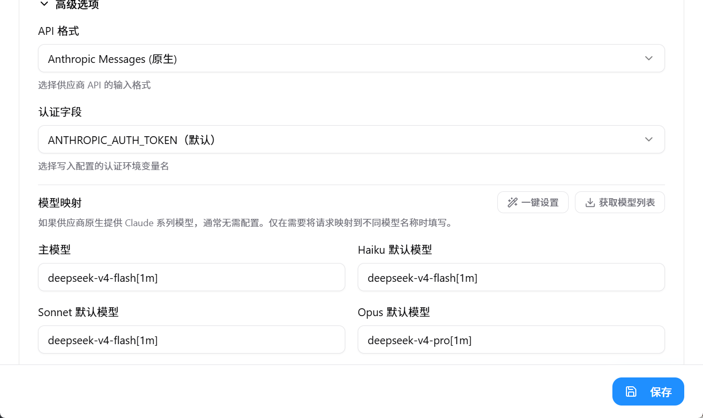

Claude Code 是 Anthropic 推出的面向开发者的 AI 编程协作工具。

实际使用中购买官方订阅不仅昂贵而且网络也是个问题。所以配置deepseek的api方式是个使用claude code不错的方案。

下面介绍claude code配置deepseek-v4的方法

推荐使用cc-switch工具: https://github.com/farion1231/cc-switch

cc-switch可以很方便的切换claude code的各种订阅以及中转

1. 添加新供应商, 选择deepseek



2. 填入自己的api-key即可



主模型填deepseek-v4-flash[1m] (开启1m上下文), 当然也可以使用deepseek-v4-pro[1m], 日常使用flash足够了, 性价比很高

附上完整配置文件

```json
{
  "env": {
    "ANTHROPIC_BASE_URL": "https://api.deepseek.com/anthropic",
    "ANTHROPIC_AUTH_TOKEN": "sk-xxx",
    "ANTHROPIC_MODEL": "deepseek-v4-flash[1m]",
    "ANTHROPIC_DEFAULT_HAIKU_MODEL": "deepseek-v4-flash[1m]",
    "ANTHROPIC_DEFAULT_SONNET_MODEL": "deepseek-v4-flash[1m]",
    "ANTHROPIC_DEFAULT_OPUS_MODEL": "deepseek-v4-pro[1m]",
    "CLAUDE_CODE_DISABLE_NONESSENTIAL_TRAFFIC": "1",
    "CLAUDE_CODE_EFFORT_LEVEL": "max"
  },
  "includeCoAuthoredBy": false,
  "permissions": {
    "allow": [
      "Bash(*)",
      "Read",
      "Write",
      "Edit"
    ],
    "deny": [
      "Bash(rm -rf *)",
      "Bash(sudo rm *)",
      "Bash(format *)",
      "Bash(del /f /s /q *)"
    ],
    "defaultMode": "bypassPermissions"
  },
  "model": "deepseek-v4-flash[1m]",
  "statusLine": {
    "type": "command",
    "command": "ccline",
    "padding": 0
  },
  "skipDangerousModePermissionPrompt": true
}
```

配置介绍:

`CLAUDE_CODE_DISABLE_NONESSENTIAL_TRAFFIC: "1"  // 关闭所有非必要网络流量`

`"CLAUDE_CODE_EFFORT_LEVEL": "max" // 最高思考强度`

`"defaultMode": "bypassPermissions" // 默认跳过权限确认弹窗`

`"skipDangerousModePermissionPrompt": true // 跳过"危险模式"启动时的二次确认弹窗`

