# 第一章

## 什么是操作系统?

操作系统（OS）是配置在计算机硬件上的第一层软件，是对硬件系统的首次扩充。

## 操作系统的目的?※

管理好各种设备，提高它们的利用率和系统的吞吐量，并为用户和应用程序提供一个简单的接口，便于用户使用。

## 操作系统的目标?※

1.方便性 2.可靠性 3.可扩充性 4.开放性 

## 调用计算机硬件的方式?

1.命令 2.系统调用 2.图标-窗口

## 单道批处理和多道批处理※

多道批处理的优缺点

优点:1.资源利用率高(内存和IO设备利用率,CPU利用率) 2.系统吞吐量大

缺点:1.平均周转时间长 2.无交互能力

## 操作系统的基本特性

名词解释:
并发 指两个或多个事件再同一时间间隔内发生。这些事件宏观上是同时发生的，但微观上是交替发生的。
操作系统的并发性指计算机系统中同时存在着多个运行着的程序。
操作系统和程序并发是一起诞生的。

共享 即资源共享，是指系统中的资源可供内存中多个并发执行的进程共同使用。
互斥共享方式 系统中的某些资源，虽然可以提供给多个进程使用，但一个时间段内只允许一个进程访问该资源。 例如同一设备QQ和微信申请摄像头进行视频。
同时共享方式 系统中的某些资源，允许一个时间段内由多个进程“同时”对它们进行访问。 例如QQ和微信分别发送文件A、B。
并发和共享互为存在条件，它们是操作系统两个最基本的特征。

虚拟 指把一个物理上的实体变为若干个逻辑上的对应物。前者是实际存在的，后者是用户感受到的。
一个程序需要放入内存并给它分配CPU才能执行。
虚拟技术分为空分复用技术和时分复用技术。如果没有并发性，就谈不上虚拟性。

异步 指在多道程序环境下，允许多个程序并发执行，但由于资源有限，进程的执行不是一贯到底而是走走停停，以不可预知的速度向前推进。

## 并行和并发的区别※

并行是指两个或多个事件, 在同一时刻可以同时进行, 而并发是指两个或多个事件在同一间隔时间内发生

单处理的各个程序只能并发运行, 而多处理机多个程序可以并行执行

## 什么是进程※

进程是指在系统中能独立运行并作为资源分配的基本单位，它是由一组机器指令、数据和堆栈等组成的，是一个能独立运行的活动实体。多个进程之间可以并发执行和交换信息。

**而线程比进程更小, 开销更小, 作为独立运行和独立调度的基本单位**

## 共享

1.互斥共享(打印机) 2.同时访问(磁盘设备)

## 虚拟

1.时分复用 2.空分复用

## 异步

在多道程序环境下，系统允许多个进程并发执行。进程运行速度不确定

# 第二章

## 进程的特征

1.动态性 2.并发性 3.独立性 4.异步性

操作系统的四个基本特征:并发,共享,虚拟,异步

## 进程的状态

就绪->执行->阻塞

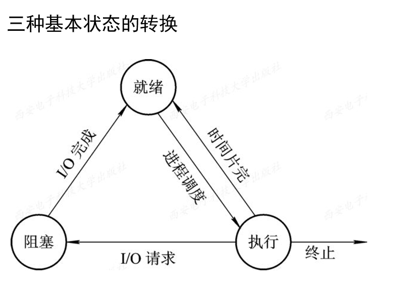

五种状态的加了个, 创建和终止

引入挂起操作后的五个进程的转换

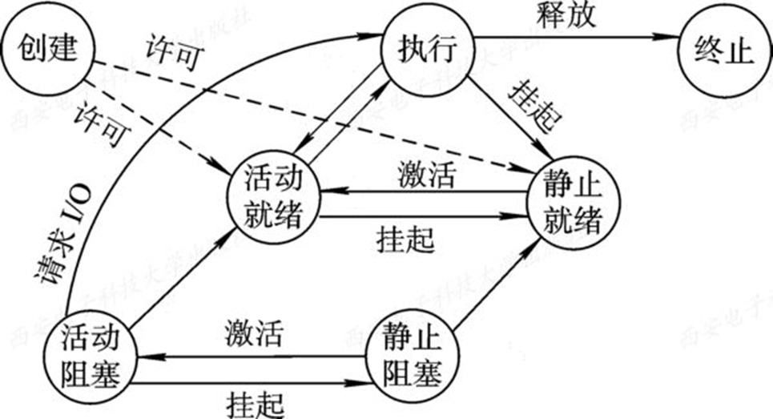

## 进程控制块

进程表又被称为进程控制块PCB，其主要作用有：
 (1) 作为独立运行基本单位的标志；
 (2) 能实现间断性运行方式；
 (3) 提供进程管理所需要的信息；
 (4) 提供进程调度所需要的信息；
 (5) 实现与其它进程的同步与通信。

进程控制块中的信息

1.进程标识符

外部标识符(创建者提供) 内部标识符(OS提供)

2.处理机状态

3.进程调度信息

4.进程控制信息

## 进程同步

进程同步的主要任务是对并发的多个进程在执行次序上进行协调，以使进程之间能够有效地共享资源和相互合作，使执行结果具有可再现性。

## 临界资源

一个时间段内只允许一个进程使用的资源称为临界资源。

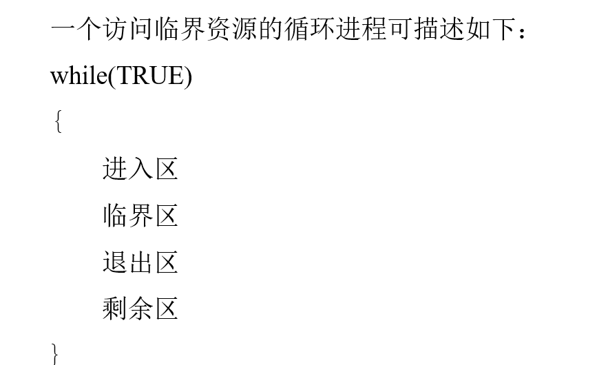

## 生产者消费者问题

使用记录型信号量 

先申请资源信号量, 再申请互斥信号量

P(wait) , V(signal)

mutex :互斥信号量

empty: 资源信号量(缓冲区) , ->空缓冲区数量

full: 满缓冲区数量

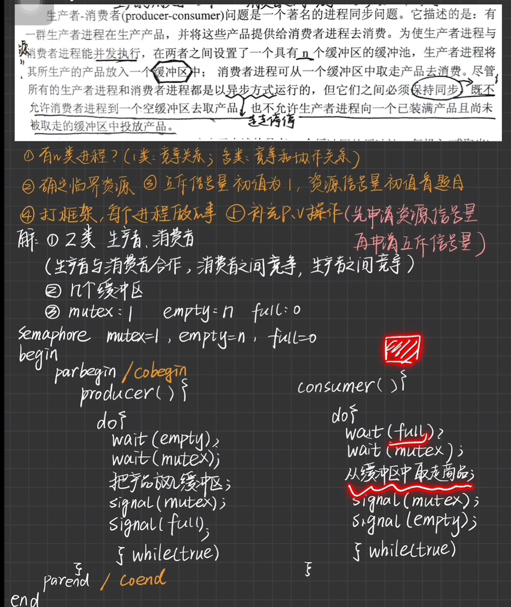

# 第三章

## CPU的利用率

## 周转时间

从作业提交给系统开始，到作业完成为止的这段时间间隔（称为作业周转时间)

## 平均周转时间

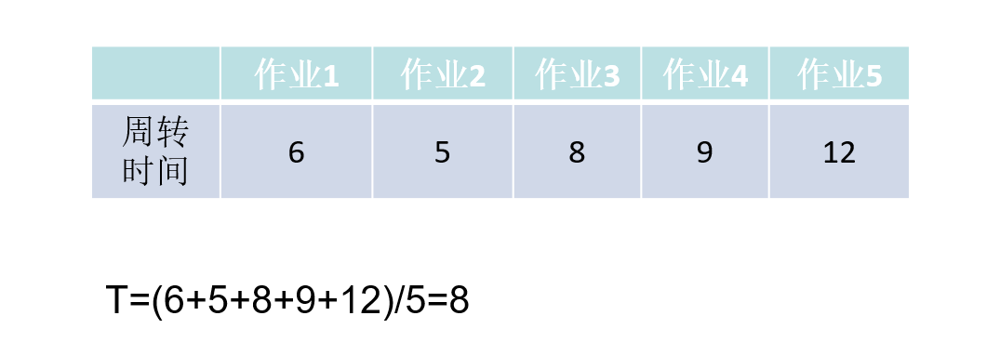

## 带权周转时间

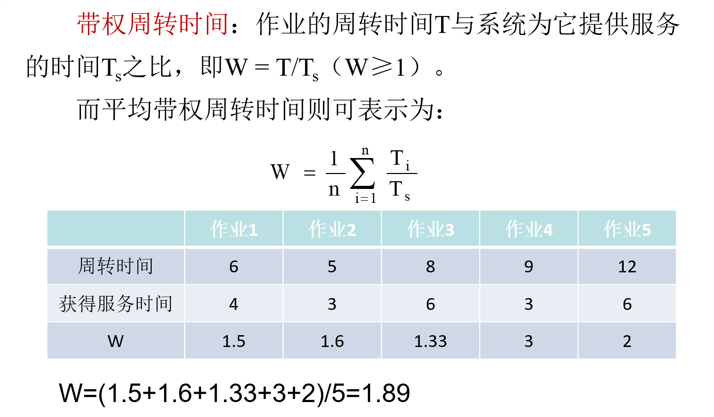

## 作业控制块

JCB, 保存了系统对作业进行管理和调用所需的全部信息

## 多道程序度

允许多少个写作业同时在内存中运行, 多道程序度的确定应根据系统的规模和运行速度等情况做适当的折衷。

## 调度算法

**FCFS先来先服务**, 有利于长作业, 不利于短作业

**SFS短作业优先**

短作业优先的缺点:

1.必须预知作业的运行时间

2.对长作业不利

3.人机无法实现交互

**SFS短作业优先(抢占式)**

每当进程到达后, 重新比较一下各进程的剩余运行时间, 剩余运行时间短的新进程抢占CPU

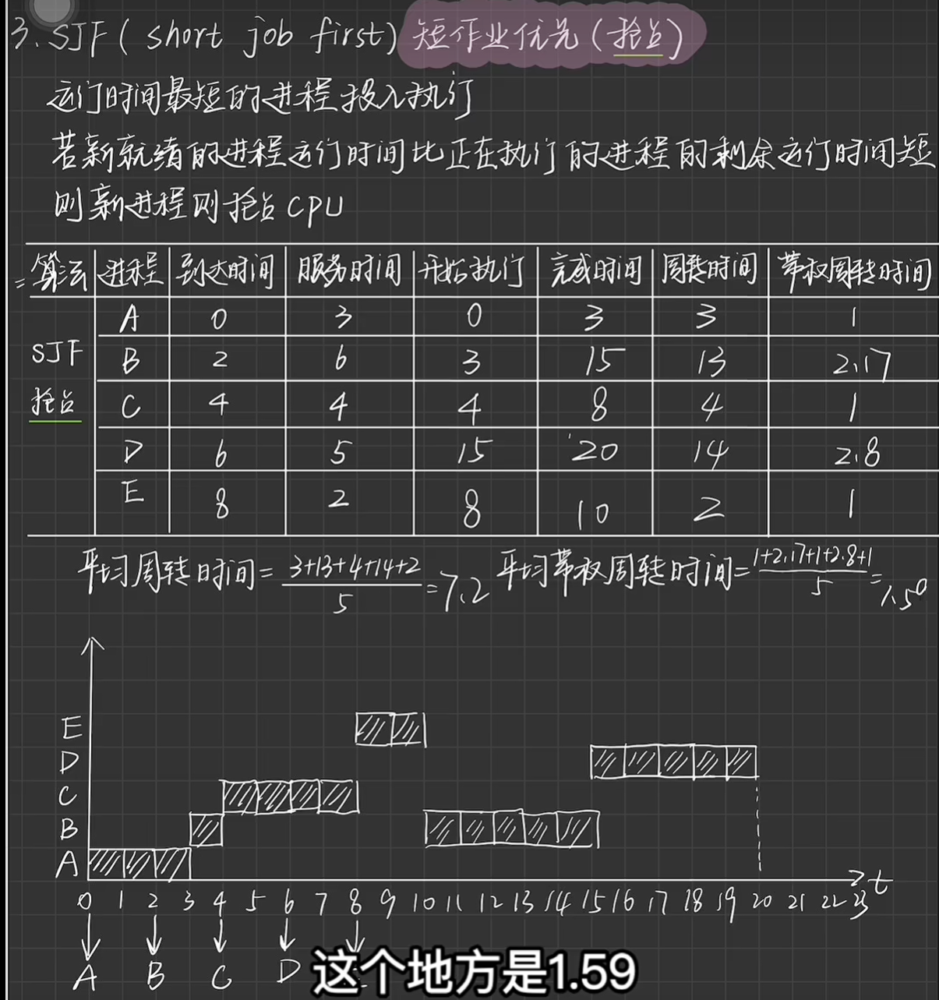

**高响应比优先调度算法**(HRRN)

每次进程执行完后, 计算已经到达的各进程的响应比, 响应比高的进程先执行

Rp(响应比)

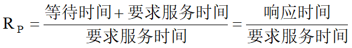

## 轮转调度算法

轮转法(RR)

进程切换时机: 
     ① 若一个时间片尚未用完，正在运行的进程便已经完成，就立即激活调度程序，将它从就绪队列中删除，再调度就绪队列中队首的进程运行，并启动一个新的时间片。
     ② 在一个时间片用完时，计时器中断处理程序被激活。如果进程尚未运行完毕，调度程序将把它送往就绪队列的末尾。

**轮转法中后到达的进程优先级高**

## 死锁

定义: 在一组进程发生死锁的情况下，这组死锁进程中的每一个进程，都在等待另一个死锁进程所占有的资源。

## 产生死锁的必要条件

1.互斥条件

指进程对所分配到的资源进行排它性使用，即在一段时间内某资源只由一个进程占用。如果此时还有其它进程请求该资源，则请求者只能等待，直至占有该资源的进程用毕释放。

2.请求和保持条件

指进程已经保持了至少一个资源，但又提出了新的资源请求，而该资源又已被其它进程占有，此时请求进程阻塞，但又对自己已获得的其它资源保持不放。

3.不可抢占条件

指进程已获得的资源，在未使用完之前，不能被其他进程强行剥夺，只能该进程在使用完时由自己释放。

4.循环等待条件

指在发生死锁时，必然存在一个进程——资源的环形链，即进程集合{P0，P1，P2，…，Pn}中的P0正在等待一个P1占用的资源； P1正在等待P2占用的资源，……，Pn正在等待已被P0占用的资源。

## 处理死锁的四种方法

(1) 预防死锁：通过设置某些限制条件，去破坏产生死锁的四个必要条件中的一个或几个条件（除第一个条件外），来预防发生死锁。
 (2) 避免死锁：在资源的动态分配过程中，用某种方法去防止系统进入不安全状态，从而避免发生死锁。
 (3) 检测死锁：允许系统在运行过程中发生死锁。但可通过检测机构及时地检测出死锁的发生，然后采取适当措施，从进程从死锁中解脱出来。
 (4) 解除死锁： 这是与检测死锁相配套的一种措施。当检测到系统中已发生死锁时，须将进程从死锁状态中解脱出来

# 第四章

## 概览

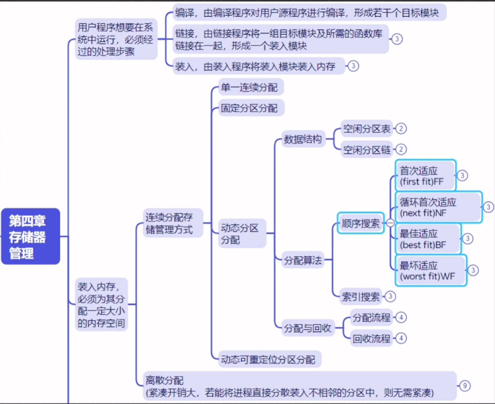

## 计算机的存储层次

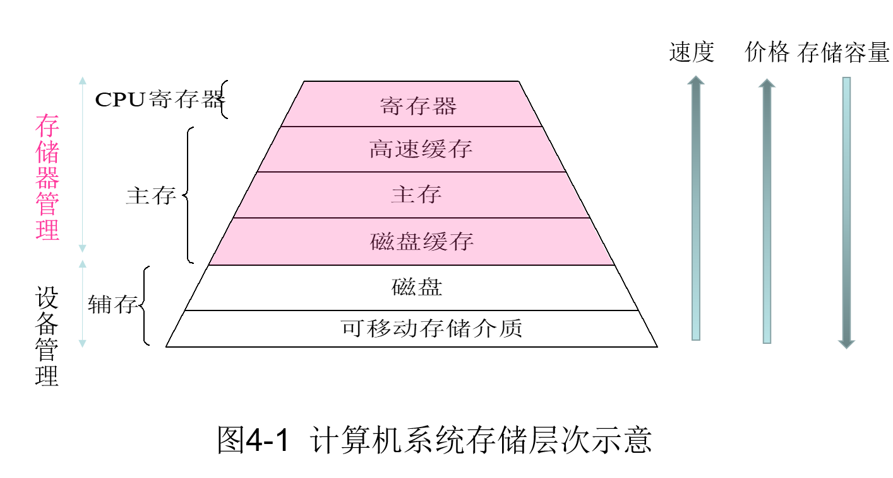

## 程序的装入

用户程序要在系统中运行, 通常都要经历三个阶段:编译->链接->装入

有三种装入方式:

1.绝对装入方式

在编译时，知道程序将驻留在内存的什么位置→产生绝对地址的目标代码→将程序和数据装入内存。

2.可重定位装入方式

把在装入时对目标程序中指令和数据的修改过程称为重定位。

地址变换通常是在装入时一次完成的，以后不再改变，故称为静态重定位。 

3.动态运行时装入

在运行过程中程序在内存中的位置可能经常要改变，此时就应采用动态运行时装入的方式。 

装入后的所有地址都仍是相对地址

## 程序的链接

1.静态链接

事先进行链接而以后不再拆开的链接方式称为静态链接方式。

2.装入时动态链接

边装入边链接

优点: 1.便于修改和更新 2.便于实现对目标模块的共享

3.运行时动态链接

## 内存分配流程

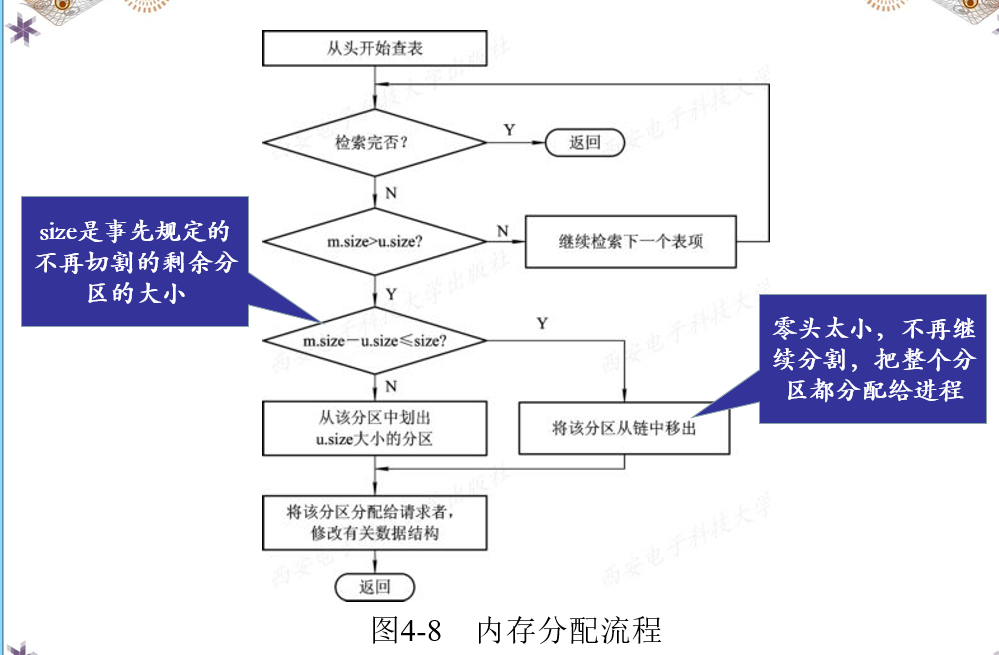

## 动态分区算法

基于顺序搜索的动态分区算法

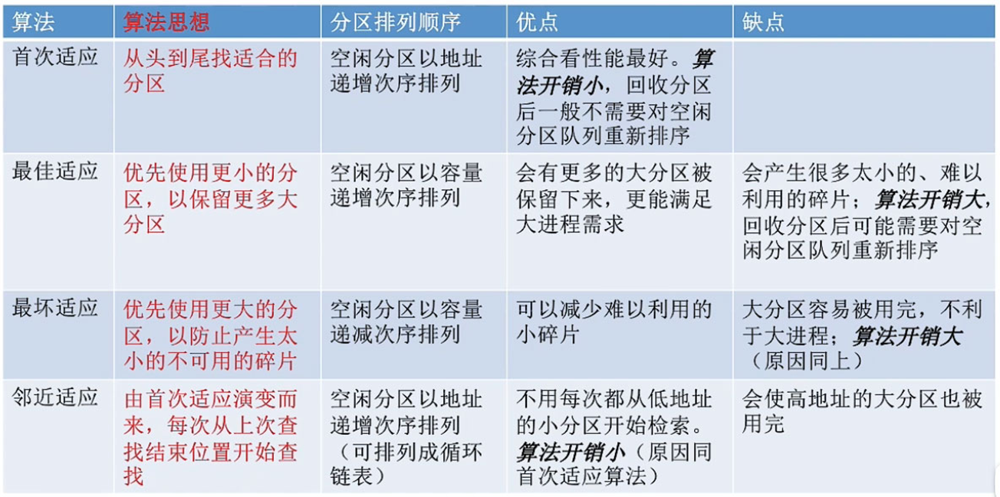

基于索引搜索的动态分区算法

1.快速适应算法

2.伙伴系统

3.哈希算法

## 紧凑

通过移动内存中的作业的位置，把原来多个分散的小分区拼接成一个大分区的方法，称为“拼凑”或“紧凑”。

## 对换

“对换”，是指把内存中暂时不能运行的进程或者暂时不用的程序和数据调出到外存上，以便腾出足够的内存空间，再把已具备运行条件的进程或进程所需要的程序和数据调入内存。

## 分页存储管理

将物理内存划分为固定大小的**页框（Frame）**，将进程的逻辑地址空间划分为同样大小的**页（Page）**。在页式管理中，页表的作用是实现从（页号）到（物理块号）的地址映射，存储页表的作用是记录内存页面的分配情况。

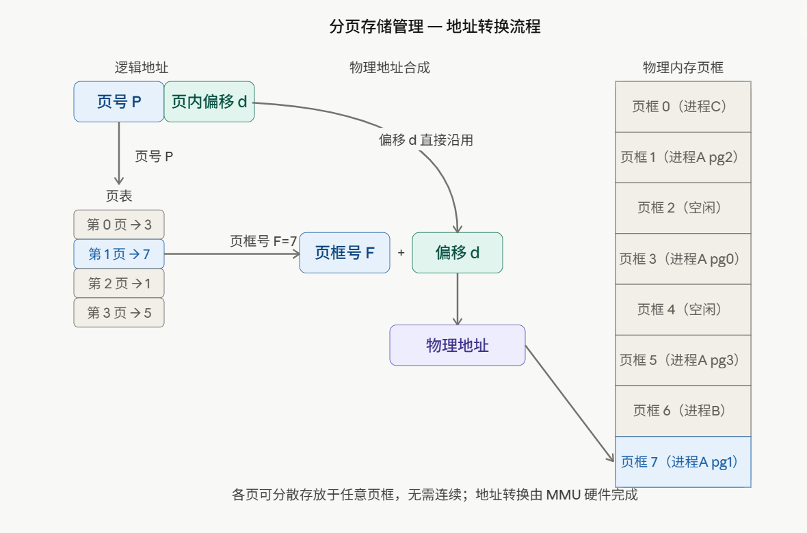

**关键概念：**

- **逻辑地址** = 页号 P + 页内偏移 d(页内地址)
- 物理地址 = 主存块号 + 页内地址
- **页表** 存储每个逻辑页对应的物理页框号
- **物理地址** = 页框号 × 页大小 + 偏移 d
- 进程的各个页可以**离散**地分布在内存各处，无需连续

主存块号 拼接 页内地址 = 最终的地址(物理地址)

## 快表

TLB

快表存在CPU中,查表时先查快表

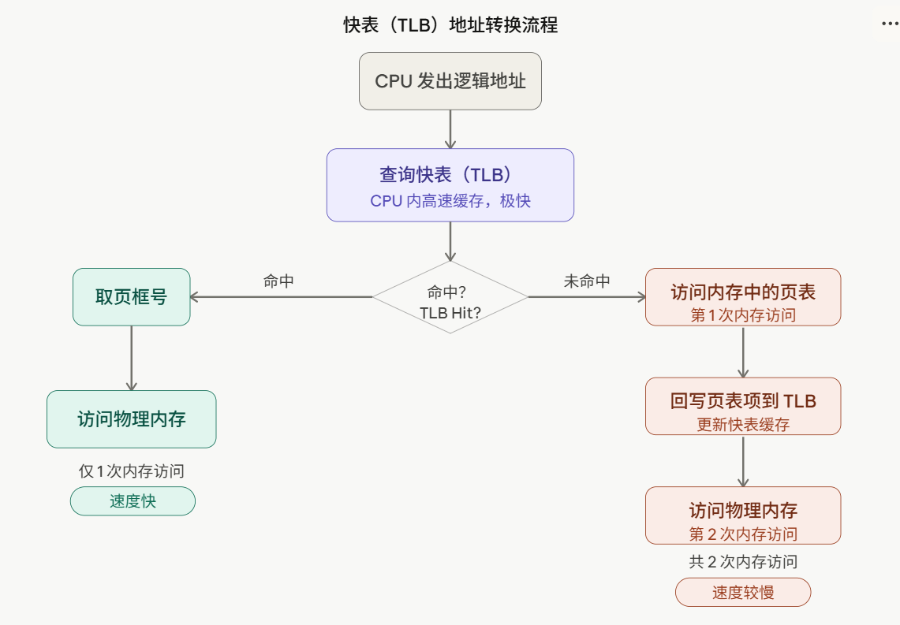

## 两级页表

两层页表的核心思想是：**把页表本身也分页存储**，不必一次性全部加载到内存，用到哪部分才加载哪部分。

## 反置页表

作用: 减少页表占用的空间大小

## 分段存储管理

按照程序的**逻辑结构**划分内存：代码段、数据段、堆栈段等。每个段有自己的段号、基地址和段长，通过**段表**进行地址转换。

与分页不同，分段是**面向用户的**，段的大小可以不同，更符合程序的自然结构。

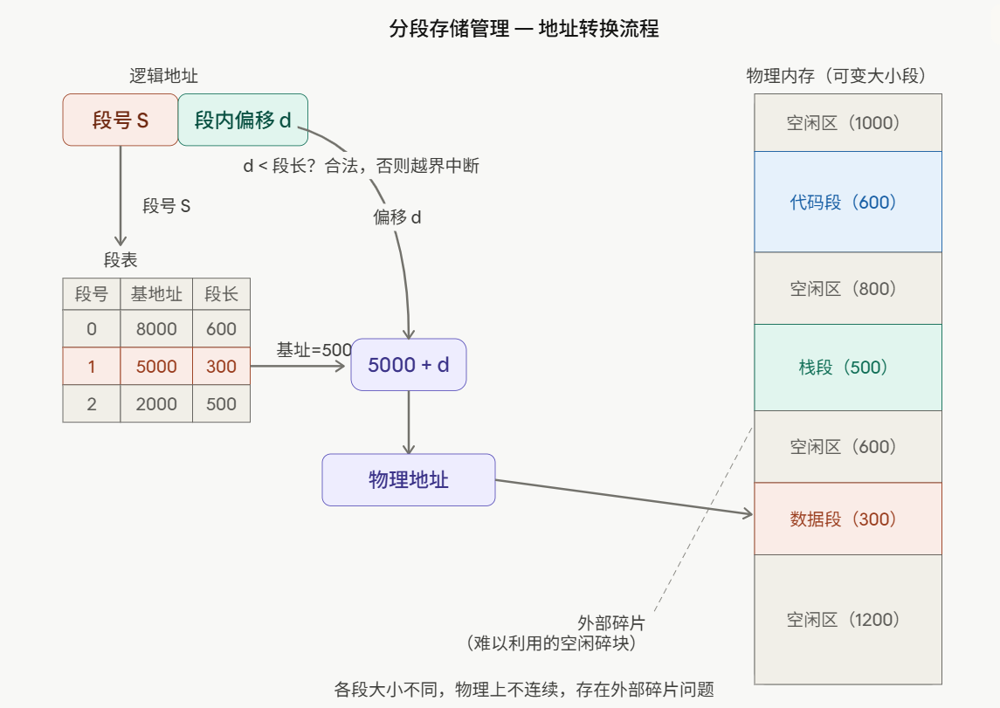

**关键概念：**

- **逻辑地址** = 段号 S + 段内偏移 d
- **段表** 记录每个段的基地址和段长（用于越界检查）
- **物理地址** = 段基地址 + 偏移 d
- 每个段大小不同，按逻辑功能划分，存在**外部碎片**问题

## 段页式存储

段页式系统的基本原理是分段和分页原理的结合，即先将用户程序分成若干个段，再把每个段分成若干个页，并为每一个段赋予一个段名。

填空题:

在段页式存储管理系统中，面向 ***（用户）\*** 的地址空间是段式划分，面向 ***（物理实现）\*** 的地址空间是页式划分。 

分页存储管理方式提供 **一维** 地址结构；分段管理提供 **二维** 的地址结构。

## 存储器管理的主要功能

内存分配, 地址映射, 内存保护,内存扩充

# 第五章

## 局部性原理

在较短的一段时间内, 程序的执行只局限于某一部分, 同样的, 它所访问的存储空间也是局限于某一区域

## 虚拟存储器的定义

虚拟存储器是指具有请求调入功能和置换功能，能从逻辑上对内存容量加以扩充的一种存储器系统。

## 页面置换算法

最佳置换算法

理想状态下的置换算法, 替换掉未来最久没使用的

先进先出(FIFO)

最近最久未使用(LRU)

## 抖动

系统中页面频繁地在内存和外存之间进行调入、调出，使处理机的大部分时间都用于页面置换而不是执行用户程序，从而导致系统性能急剧下降的现象，称为抖动

## 工作集

在某段时间间隔▲内,进程实际所要访问页面的集合

## 

# 第六章

# 第七章
