重点: 2,3,4,5章

重点:

 题型: 选择,名词解释,解答,计算

第一章:

多道批处理系统的优缺点

并行与并发的区别

进程和线程

第二章:

前驱图

进程的特征

进程的状态

pcb的作用

生产者和消费者算法(计算题)

第三章

cpu的利用率

fcfs, sjs,rr轮转时间片法

产生死锁的条件

处理死锁的方法

预防死锁(银行家算法)

第四章

动态分区算法

对换(名词解释)

分页/分段存储管理

第五章

虚拟存储器的概念

页面置换算法

最佳置换算法

先来先置换算法

缺页率,置换多少次, 缺页多少次

抖动(名词解释)

第六章

假脱机(Spoling)

第七章

保护域(名词解释)

第八章

空闲表法/空闲链表法

提高磁盘的速度的方法

raid的优点

# 操作系统引论

## 操作系统的目标和作用

目标: 

- 方便性
- 有效性
- 可扩充性
- 开放性

作用:

1. OS作为用户与计算机硬件系统之间的接口

(1)命令方式 (2) 系统调用方式 (3) 图标, 窗口方式

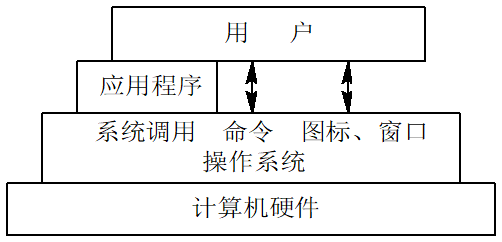

1. OS作为计算机系统资源的管理者 

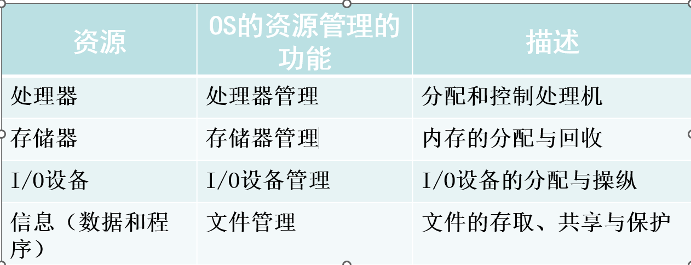

1. OS实现了对计算机资源的抽象

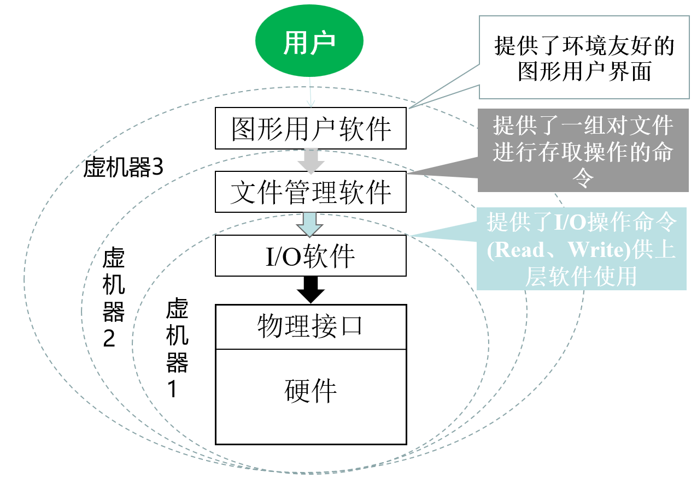

## 操作系统的发展过程

### 未配置操作系统的计算机系统  

1. 人工操作方式(纸带)
2. 脱机输入/输出(Off-Line I/O)方式

###  单道批处理系统

为实现对作业的连续处理，需要先把一批作业以脱机方式输入到磁带上，并在系统中配上监督程序(Monitor)，在它的控制下，使这批作业能一个接一个地连续处理。

图例:

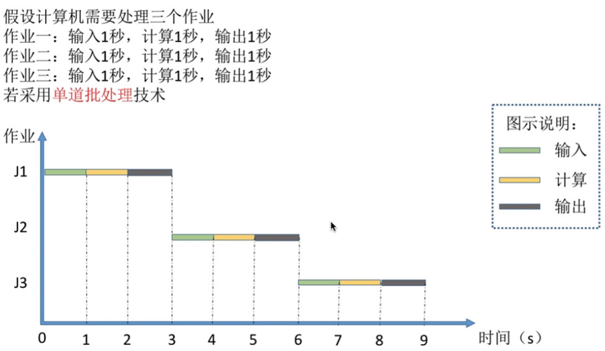

缺点:  系统的资源得不到充分的利用

### 多道批处理系统

优点:

- 提高CPU的利用率
- 可提高内存和I/O设备的利用率
- 增加系统吞吐量

举例:

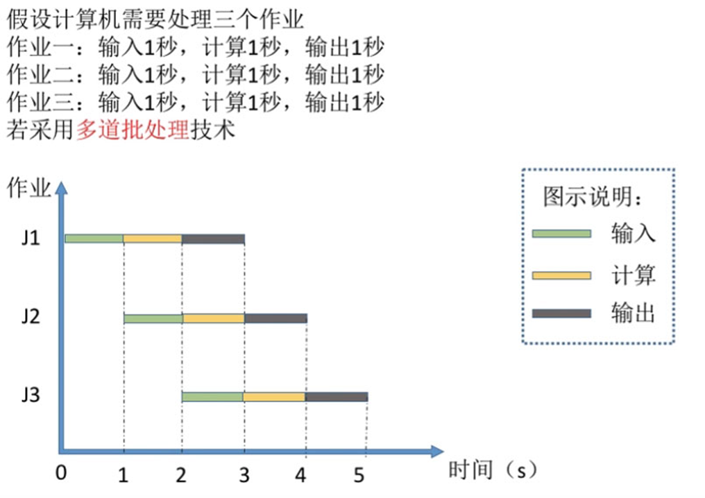

缺点: 平均周转时间长, 无交互能力

### 分时系统

及时接收, 及时处理

系统应能及时接收并及时处理该命令，再将结果返回给用户。 此后， 用户可继续键入下一条命令，此即人—机交互。应强调指出，即使有多个用户同时通过自己的键盘键入命令，系统也应能全部地及时接收并处理。

### 实时系统

所谓“实时”，是表示“及时”，而实时系统(Real-Time System)是指系统能及时(或即时)响应外部事件的请求，在规定的时间内完成对该事件的处理，并控制所有实时任务协调一致地运行。

#### 实时任务

按任务执行时是否呈现周期性来划分:

(1)周期性实时任务

(2)非周期性实时任务      

根据对截止时间的要求来划分:

(1) 软实时任务

(2) 硬实时任务

### 实时系统与分时系统的比较

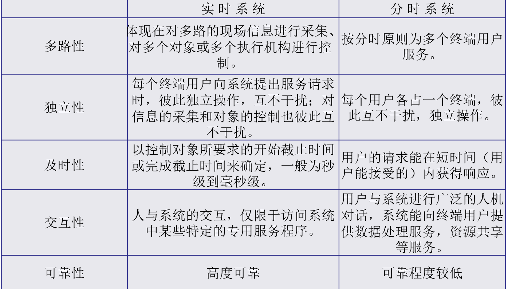

### 微机操作系统的发展

- 单用户单任务操作系统
- 单用户多任务操作系统(Windows)
- 多用户多任务操作系统(UNIX OS)

## 操作系统的基本特性

1. 并发

进程: 进程是指在系统中能独立运行并作为资源分配的基本单位，它是由一组机器指令、数据和堆栈等组成的，是一个能独立运行的活动实体。多个进程之间可以并发执行和交换信息。一个进程在运行时需要一定的资源，如CPU、存储空间及I/O设备等

进程作为分配资源的基本单位，而把线程作为独立运行和独立调度的基本单位

进程 > 线程 (一个进程中可存在多个线程)

2. 共享

互斥共享(打印机/ 磁带机)

同时访问(磁盘设备)

3. 虚拟

- 时分复用技术
- 空分复用技术

4. 异步

## 操作系统的主要功能(理解)

1.处理机管理

- 进程控制
- 进程同步
- 进程通信
- 调度
	- 作用调度
	- 进程调度

2.存储器管理

- 内存分配
- 内存保护
- 地址映射
- 内存扩充

3.设备管理

- 缓冲管理

4.文件管理

- 文件存储空间的管理
- 目录管理
- 文件的读/写管理和保护

5.操作系统与用户之间的接口

- 用户接口
- 程序接口

# 进程的描述与控制

## 前趋图和程序执行

前趋图(Precedence Graph)，是指一个有向无循环图，可记为DAG(Directed Acyclic Graph)，它用于描述进程之间执行的先后顺序。

起点成为初始结点, 终点称为终止结点, 前趋图不允许循环

程序顺序执行(顺序性,封闭性和可再现性)和程序并发执行(间断性, 失去封闭性, 不可复现性)

## 进程的描述

进程实体（又称进程映像）由程序段、相关的数据段和进程控制块（Process Control Block, PCB）三部分组成。

创建进程：实质上是创建进程实体中的PCB。撤销进程，实质上是撤销进程的PCB。

进程的特征:

- 动态性
- 并发性
- 独立性
- 异步性

进程的三种基本状态: 就绪, 执行, 阻塞

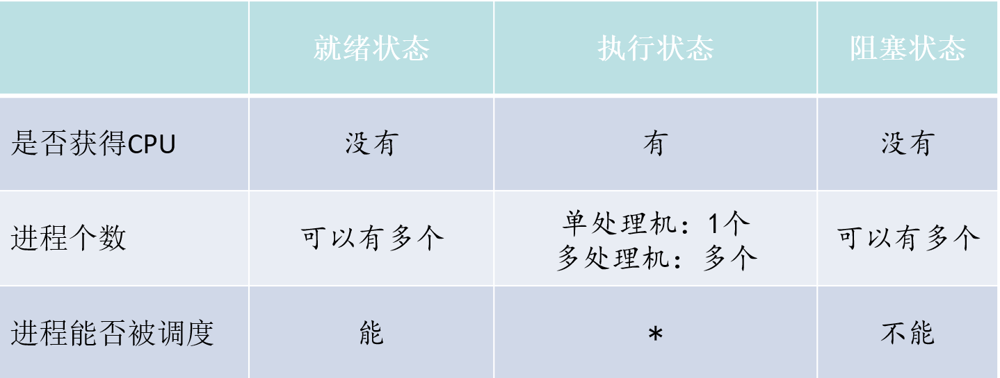

进程之间的转换:

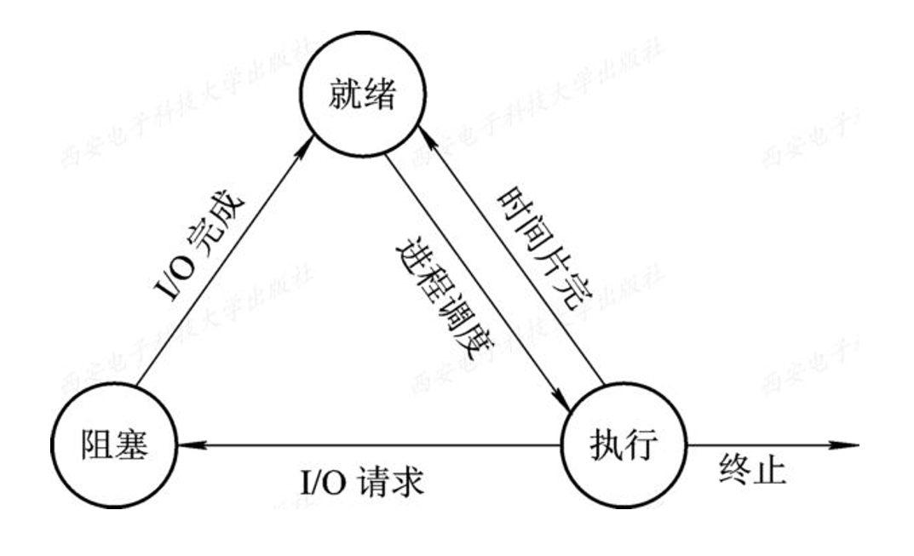

进程的五种状态(加上创建和终止)

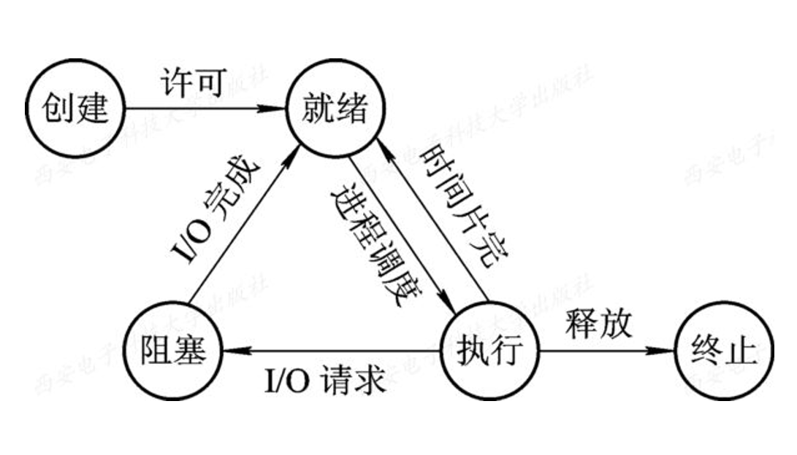

挂起是把一个进程从内存换成外存

 **原语**(Primitive)是由若干条指令组成的、用于完成一定功能的一个过程。原语是原子操作，即一个操作中的动作要么全做，要么全不做，是一个不可分割的单位。

具有挂起状态的进程状态图:

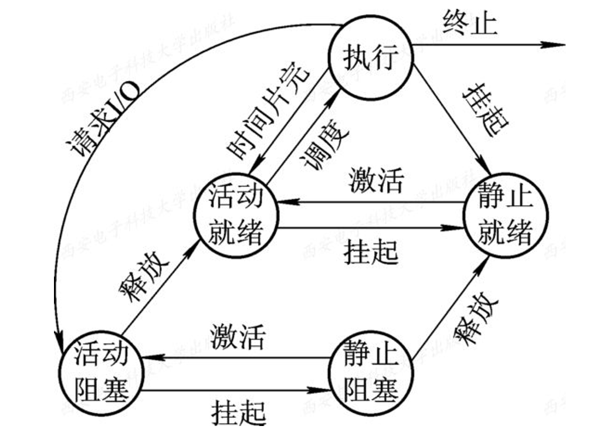

PCB包含:

- 进程标识符(PID)
  - 外部标识符(创建者提供)
  - 内部标识符(OS提供)
- 处理机状态
- 进程调度信息
- 进程控制信息

进程控制块的组织方式

(1) 线性方式

(2) 链接方式

(3) 索引方式

## 进程控制

进程控制的主要任务: (1)创建进程 (2)撤销进程 (3) **实现进程状态的转换**

Create原语(创建)

终止原语

block原语(阻塞)

wakeup原语(唤醒)

suspend原语(挂起)

active原语(激活)

## 进程同步

进程同步的主要任务: 进程同步的主要任务是对并发的多个进程在**执行次序上**进行协调，以使进程之间能够有效地共享资源和相互合作，使**执行结果具有可再现性**。

临界资源: 一个时间段内只允许一个进程使用的资源

进程互斥(访问临界资源)和进程同步

生产者和消费者共享变量(in, out, counter), 生产者对它做加1操作，消费者对它做减1操作

### 硬件同步机制

- 关中断
- 利用Test-And-Set指令实现互斥
- 利用Swap指令实现进程互斥

### 信号量机制

整型信号量定义为一个用于表示资源数目的整型量S。仅能通过两个标准的原子操作来访问(P和V)

记录型信号量, 除了有一个代表资源数目的整形变量外, 还应增加一个进程链表指针list，用于链接上述的所有等待进程。

AND型信号量是针对共享多个临界资源

AND同步特点: 要么全部分配到进程，要么一个也不分配。 

利用信号量机制可以实现进程互斥和进程同步

管程机制

## 经典进程的同步问题

生产者-消费者问题(记录型信号量, And信号量)
哲学家进餐问题(记录型信号量, And信号量)
读者-写者问题

## 进程通信

## 线程的基本概念

在OS中引入进程的目的是为了使多个程序能并发执行，以提高资源利用率和系统吞吐量。

在操作系统中再引入**线程**，是为了减少程序在并发执行时所付出的时空开销，使OS具有更好的并发性。

进程的两个基本属性:

1. 进程是一个可拥有资源的独立单位。
2. 进程同时又是一个可独立调度和分派的基本单位。

# 处理机调度与死锁

## 处理机调度的层次和调度算法的目标

高级调度(作业调度)

中级调度(内存调度)

低级调度(进程调度)

## 作业与作业调度

先来先服务(fcfs)

短作业优先(sjf)

高响应比优先调度算法

响应比 = (等待时间 + 要求服务时间) / 要求服务时间 = 响应时间 / 要求服务时间

## 进程调度

# 存储器管理

## 存储器的层次结构

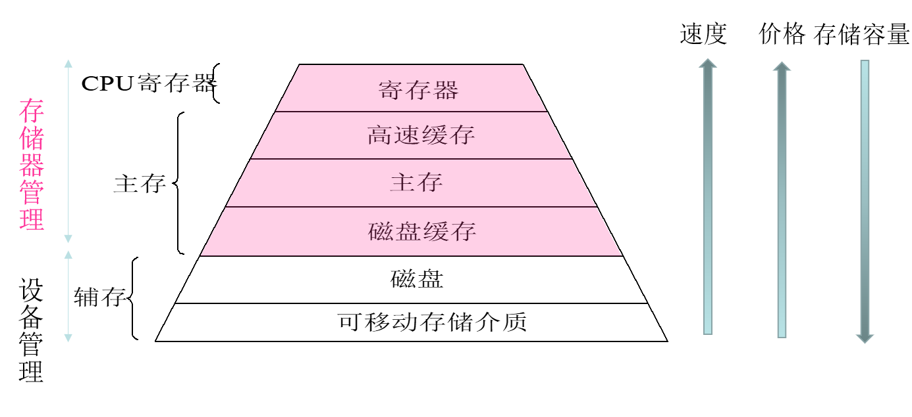

## 动态分区算法

