# 机器学习概述

Machine Learning(机器学习)

常见术语

样本，特征，标签/目标值

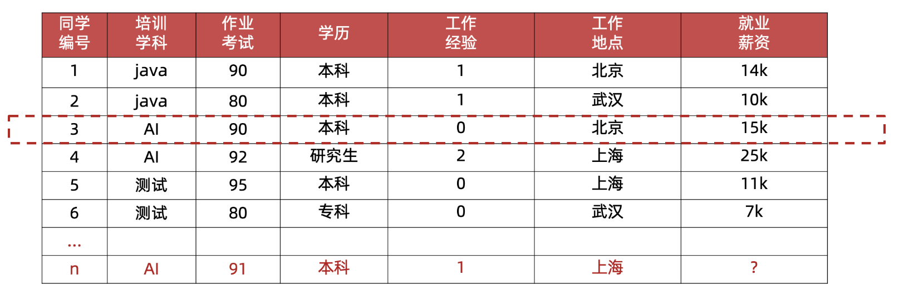

样本(sample) ：一行数据就是一个样本；多个样本组成数据集；有时一条样本被叫成一条记录

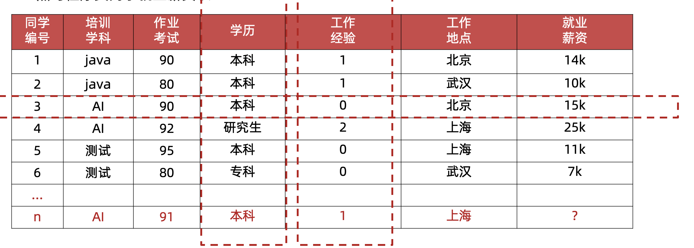

特征(feature) ：一列数据一个特征，有时也被称为属性

 

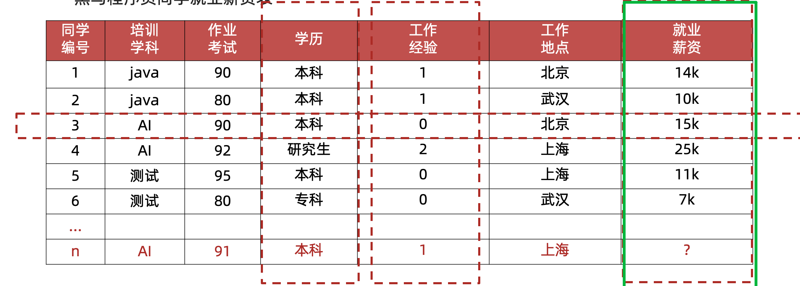

标签/目标(label/target) ：模型要预测的那一列数据。本场景是就业薪资

就业薪资 与 培训学科、作业考试、学历、工作经验、工作地点 5个特征有关系

特征如何理解（重点）：特征是从数据中抽取出来的，对结果预测有用的信息  eg:房价预测、车图片识别

### 数据集划分

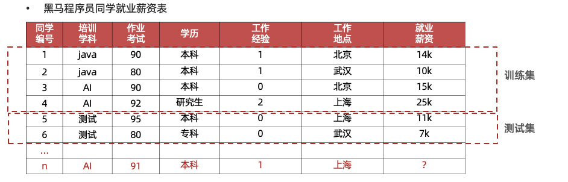

数据集可划分两部分：训练集、测试集  比例：8 : 2，7 : 3 

训练集(training set) ：用来训练模型（model）的数据集

测试集(testing set)：用来测试模型的数据集

### 有监督学习

- 定义：输入数据是由输入特征值和目标值所组成，即输入的训练数据有标签的

- 数据集：需要人工标注数据

  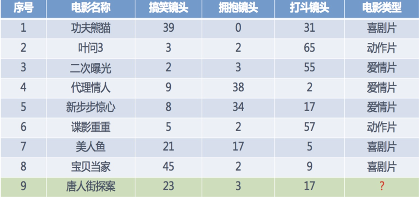

#### 分类

- 目标值（标签值）是不连续的

- 分类种类：二分类、多分类任务、

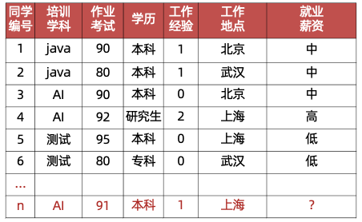

#### 回归

目标值（标签值）是连续的

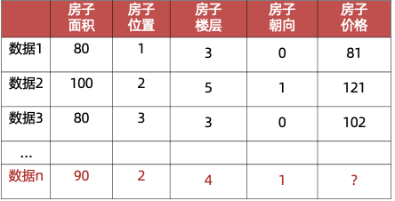

### 无监督学习

- 定义：输入数据没有被标记，即样本数据类别未知，**没有标签**，根据样本间的相似性，对样本集聚类，以发现事物内部 结构及相互关系。

- 数据集：不需要标注数据

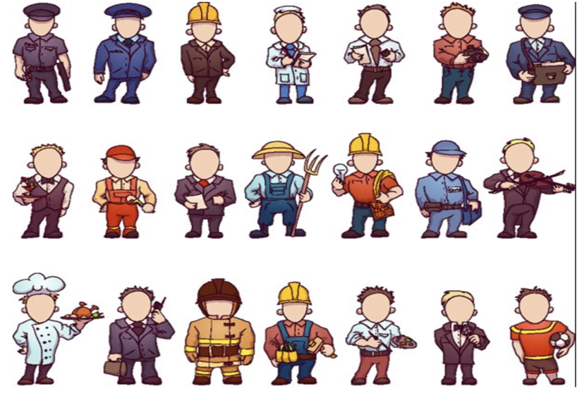

**无监督学习特点：**

 **1** 训练数据无标签

 2 根据样本间的相似性对样本集进行聚类，发现事物内部结构及相互关系

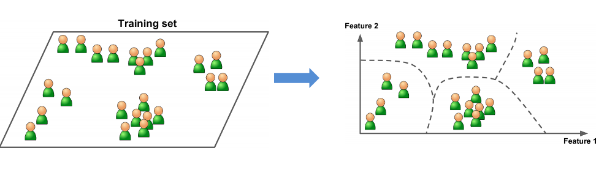

### 半监督学习

工作原理：

1 让专家标注少量数据，利用已经标记的数据（也就

  是带有类标签）训练出一个模型

2 再利用该模型去套用未标记的数据

3 通过询问领域专家分类结果与模型分类结果做对比，

   从而对模型做进一步改善和提高

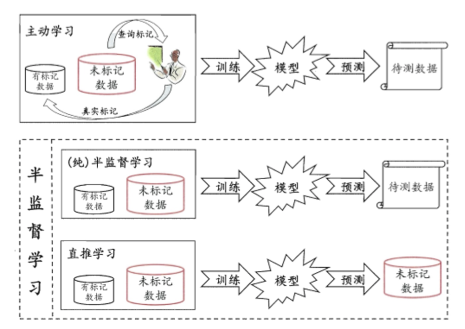

半监督学习方式可大幅降低标记成本

### 强化学习

1 强化学习（Reinforcement Learning）：机器学习的一个重要分支

2 应用场景：里程碑AlphaGo围棋、各类游戏、对抗比赛、无人驾驶场景

3 基本原理：基本原理：通过构建四个要素：agent，环境状态，行动，奖励，

 agent根据环境状态进行行动获得最多的累计奖励。。

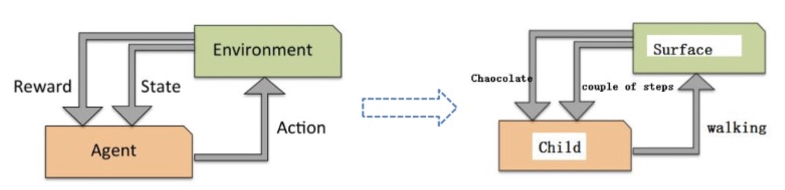

小孩子学走路：

​    (1) 小孩就是 **agent**，他试图通过采取**行**（即行走）来操纵**环境**（地面），

​    (2) 并且从**一个状态转变到另一个状态**（即他走的每一步），

​    (3) 当他完成任务的子任务（即走了几步）时，孩子得到**奖励**（给巧克力吃），

​    (4) 并且当他不能走路时，就不会给巧克力。

### 总结

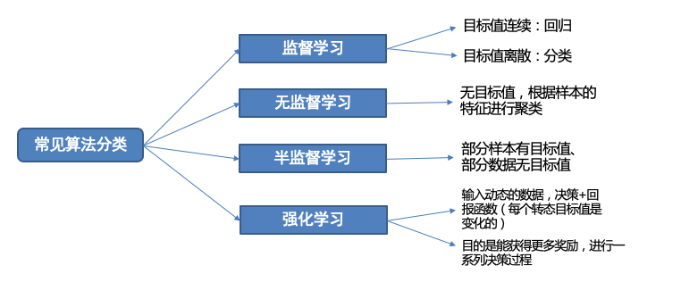

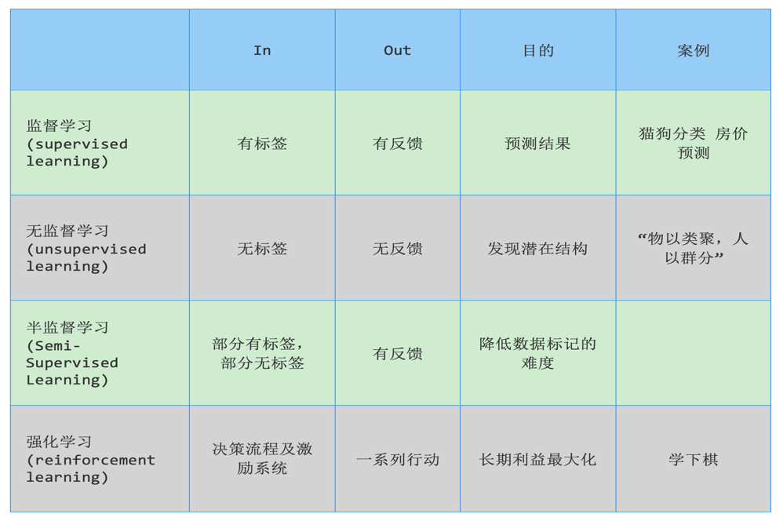

## 特征工程

**学习目标：**

1.知道特征工程是什么？

2.理解特征提取的作用

3.理解特征预处理的作用

4.了解特征降维、特征选择、特征组合

### 特征工程

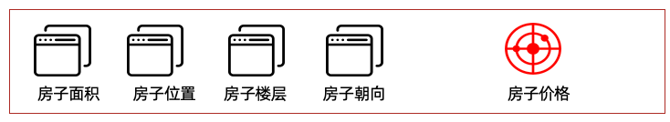

从数据集角度来看：    一列一列的数据为特征。

从模型训练角度来看： 对预测结果有用的属性为特征

特征工程是：利用专业背景知识和技巧处理数据，让机器学习算法效果最好。这个过程就是特征工程

Coming up with features is difficult, time-consuming, requires expert knowledge. “Applied machine learning” is basically feature engineering. ”

释义：特征工程是困难、耗时、需要专业知识。应用机器学习基础就是特征工程                             

【理解】数据和特征决定了机器学习的上限，而模型和算法只是逼近这个上限而已。

### 特征提取

从原始数据中提取与任务相关的特征，构成特征向量

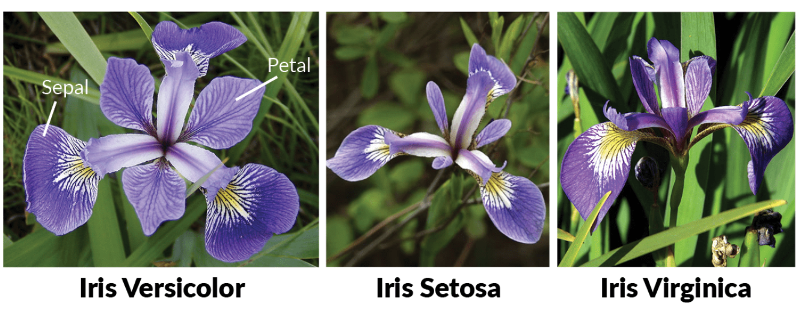

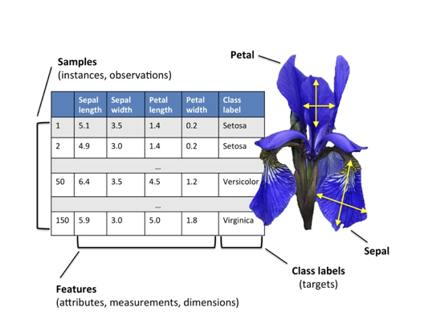

对于文本、图片这种非行列形式的数据行列形式转换，

一旦转换成行列形式一列就是特征

### 特征预处理

特征对模型产生影响；因量纲问题，有些特征对模型影响大、有些影响小

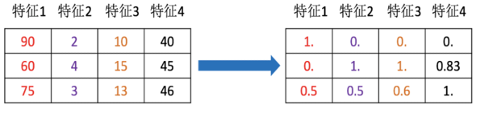

将不同的单位的特征数据转换成同一个范围内

使训练数据中不同特征对模型产生较为一致的影响

### 特征降维

将原始数据的维度降低，叫做特征降维

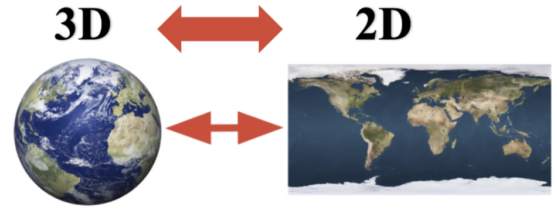

会丢失部分信息。降维就需要保证数据的主要信息要保留下来

原始数据会发生变化，不需要了解数据本身是什么含义，它保留了最主要的信息

### 特征选择

原始数据特征很多，但是对任务相关是其中一个特征集合子集。

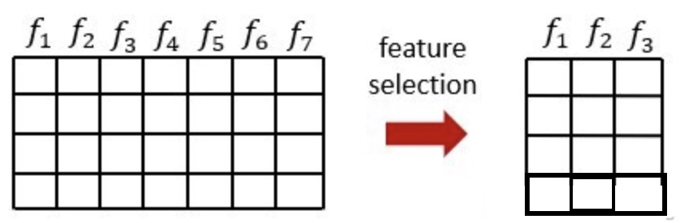

从特征中选择出一些重要特征（选择就需要根据一些指标来选择）

特征选择不会改变原来的数据

### 特征组合

把多个的特征合并成一个特征。

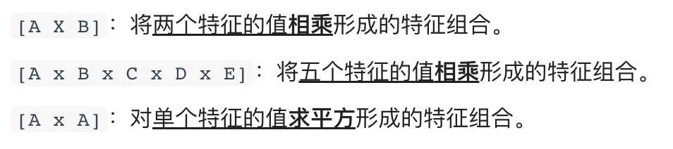

通过加法、乘法等方法将特征值合并

## 模型拟合问题

**学习目标：**

1.知道拟合是什么？

2.理解过拟合、欠拟合是什么？

3.知道过拟合、欠拟合出现的原因

4.理解泛化是什么？

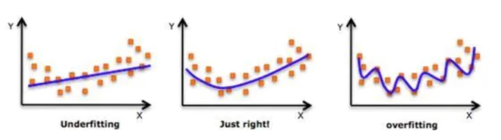

拟合：用来表示模型对样本点的拟合情况

欠拟合：模型在训练集上表现很差、在测试集表现也很差

原因：模型过于简单

过拟合：模型在训练集上表现很好、在测试集表现很差

原因：模型太过于复杂、数据不纯、训练数据太少

泛化：模型在新数据集（非训练数据）上的表现好坏的能力

奥卡姆剃刀原则：给定两个具有相同泛化误差的模型，较简单的模型比较复杂的模型更可取

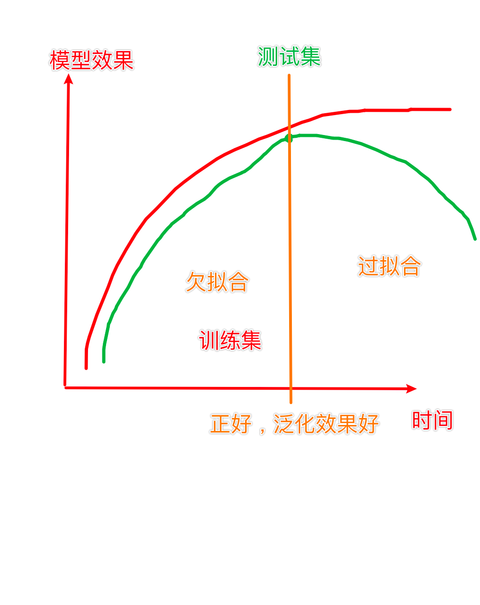

# KNN算法

## KNN算法简介

**学习目标：**

1.理解K近邻算法的思想

2.知道K值选择对结果影响

3.知道K近邻算法分类流程

4.知道K近邻算法回归流程

### KNN算法思想

K-近邻算法（K Nearest Neighbor，简称KNN）。比如：根据你的“邻居”来推断出你的类别

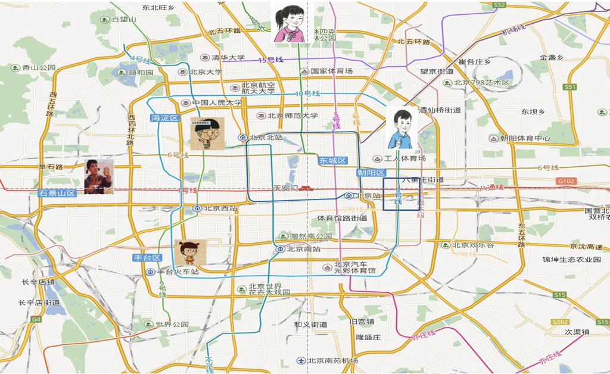

KNN算法思想：如果一个样本在特征空间中的 k 个最相似的样本中的大多数属于某一个类别，则该样本也属于这个类别 

思考：如何确定样本的相似性？

**样本相似性**：样本都是属于一个任务数据集的。样本距离越近则越相似。

利用K近邻算法预测电影类型

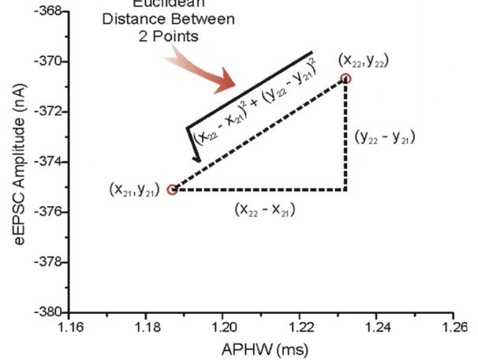

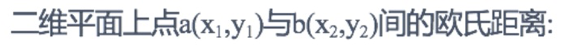

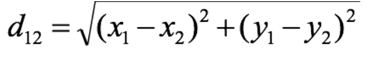

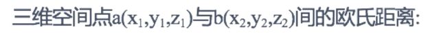

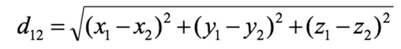

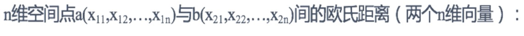

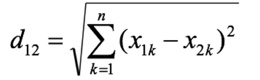

### K值的选择

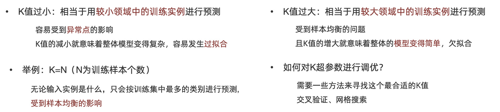

