## Word Embedding  

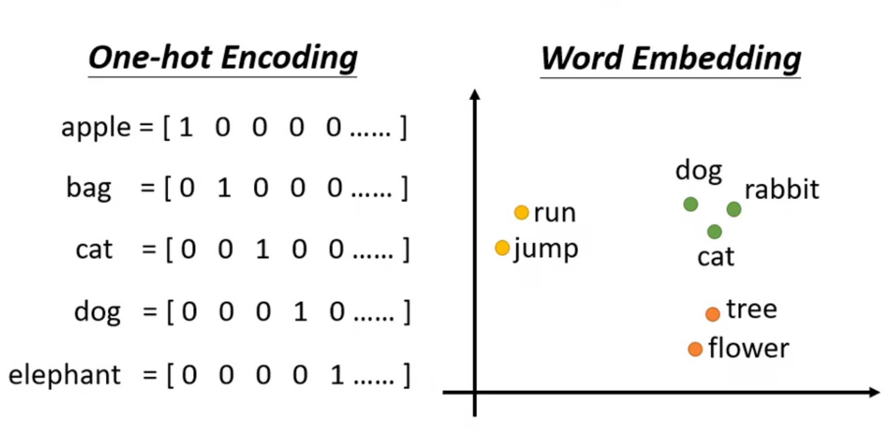

Word Embedding 会给每一个词汇一个向量, 而一个句子就是一排长度不一的向量

声音信号也是一堆向量

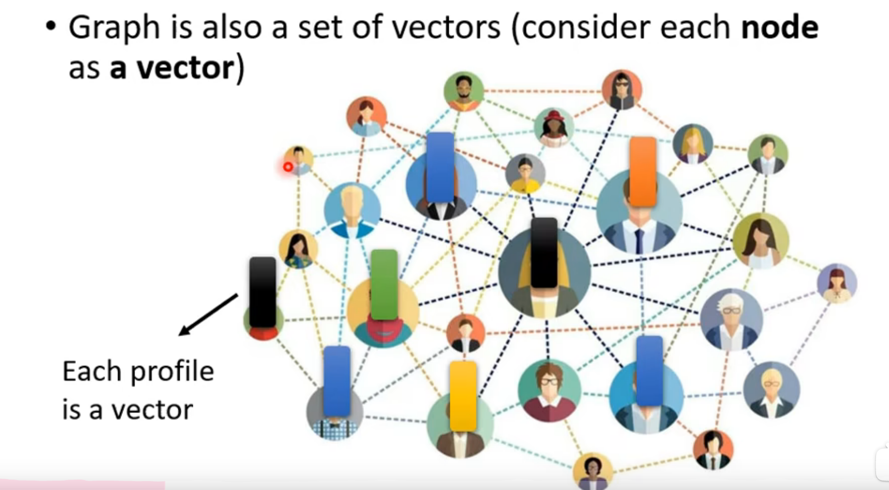

一个分子也可以看做一个graph

## 三种可能输出

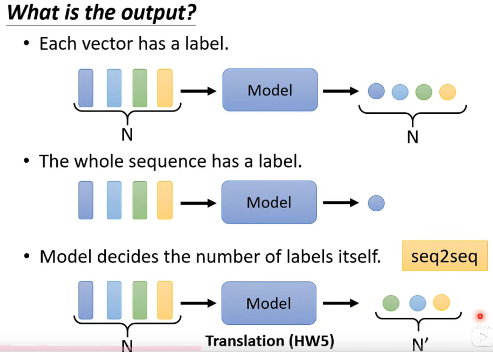

## Sequence Labeling

第一种输出也叫 Sequence Labeling

FC: Fully-connected network

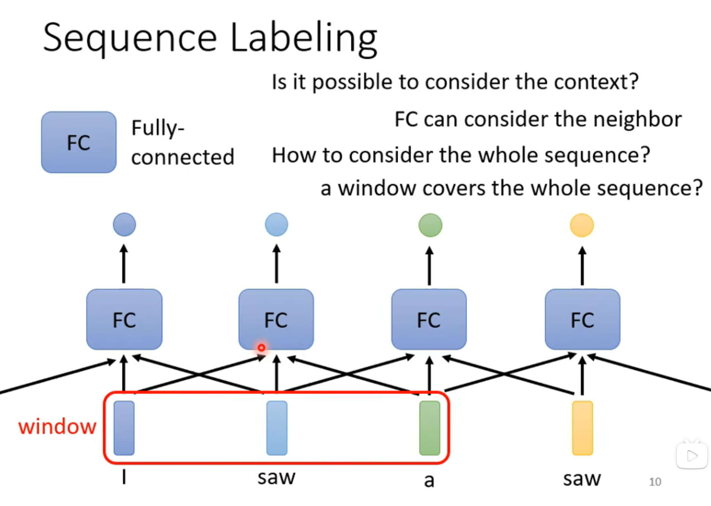

## Self-attention

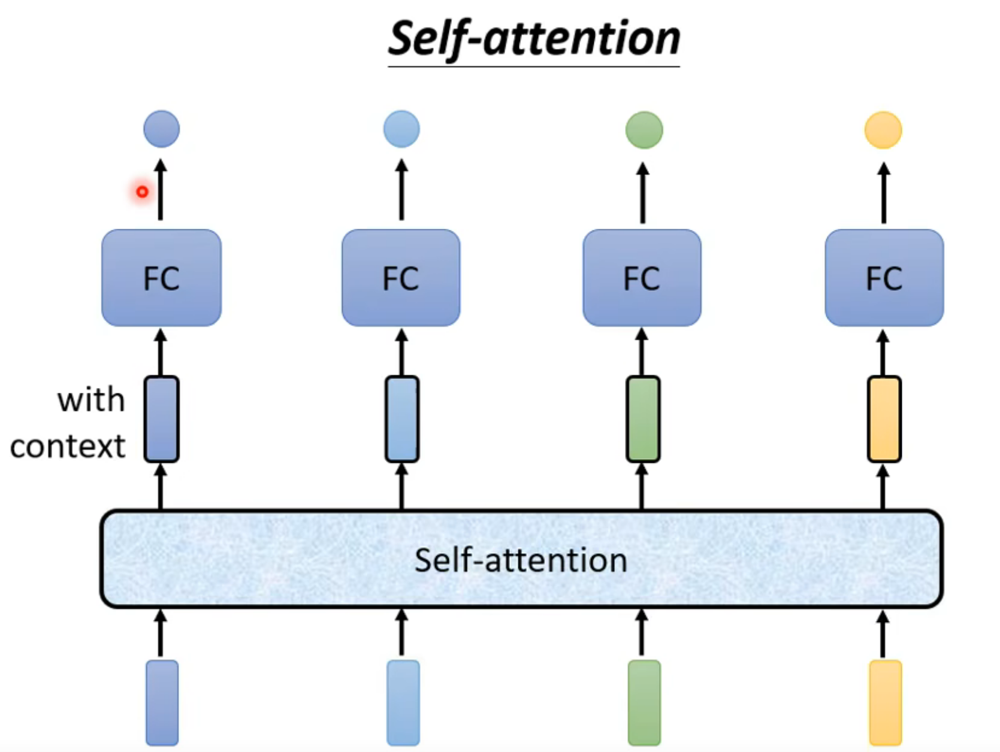

self-attention 可以叠加很多次

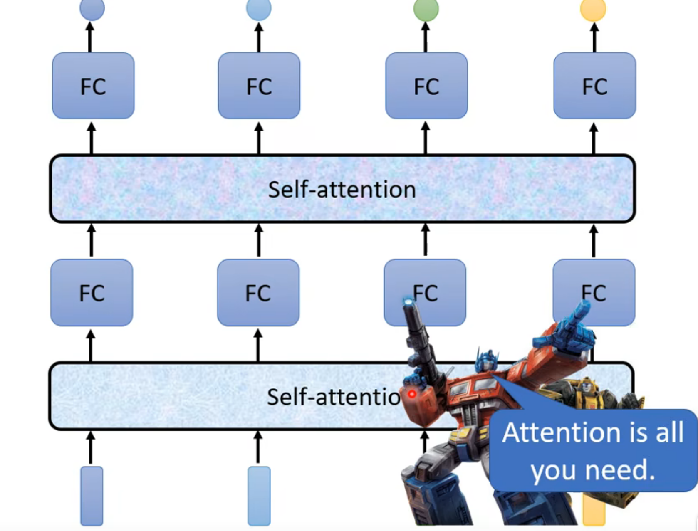

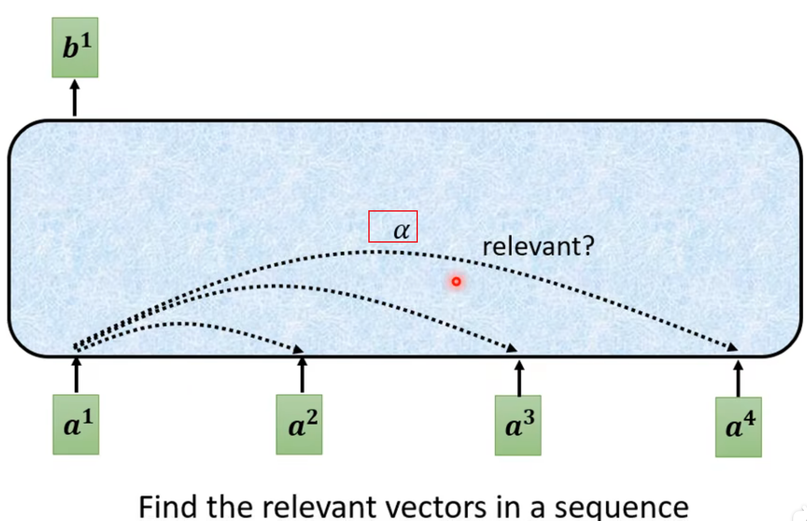

计算α的方法有很多种

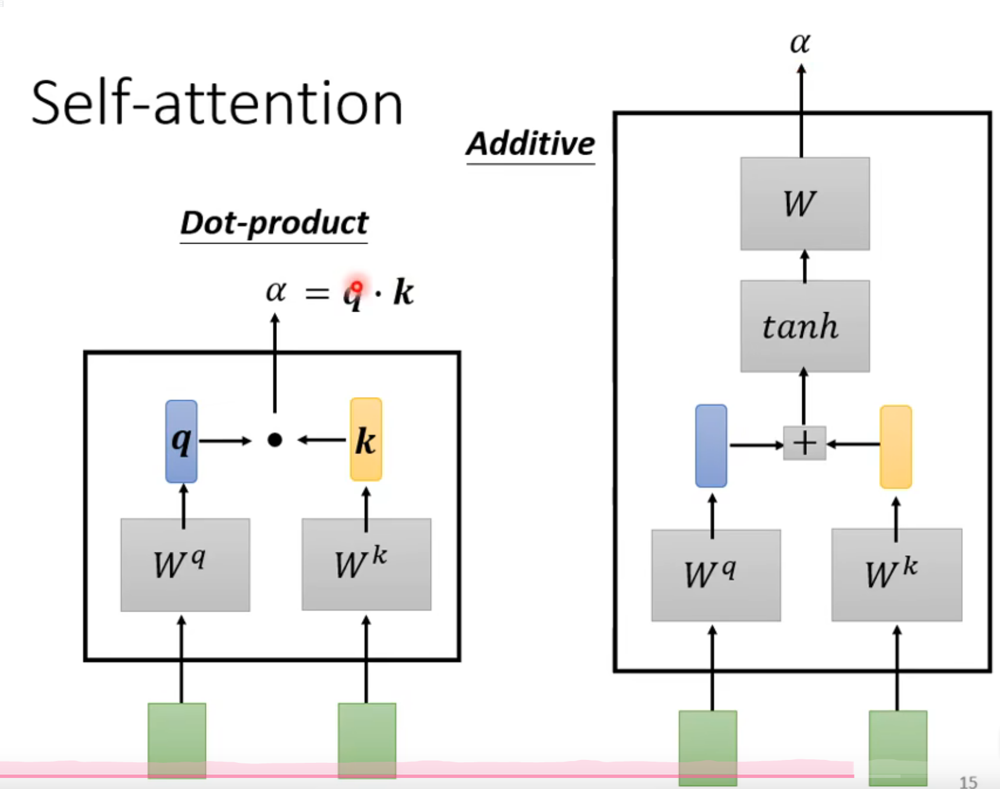

一般采用Dot-product 去计算 attention score

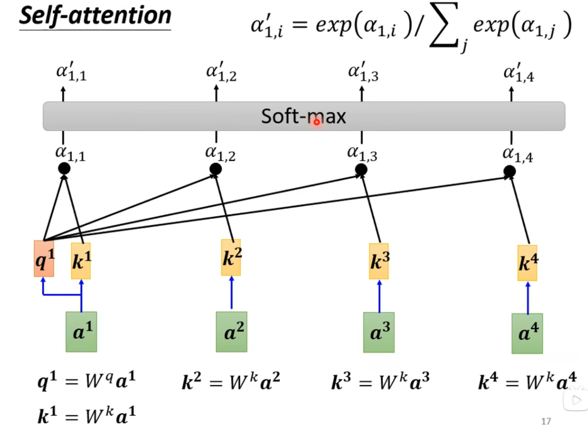

由a怎么得到的qkv

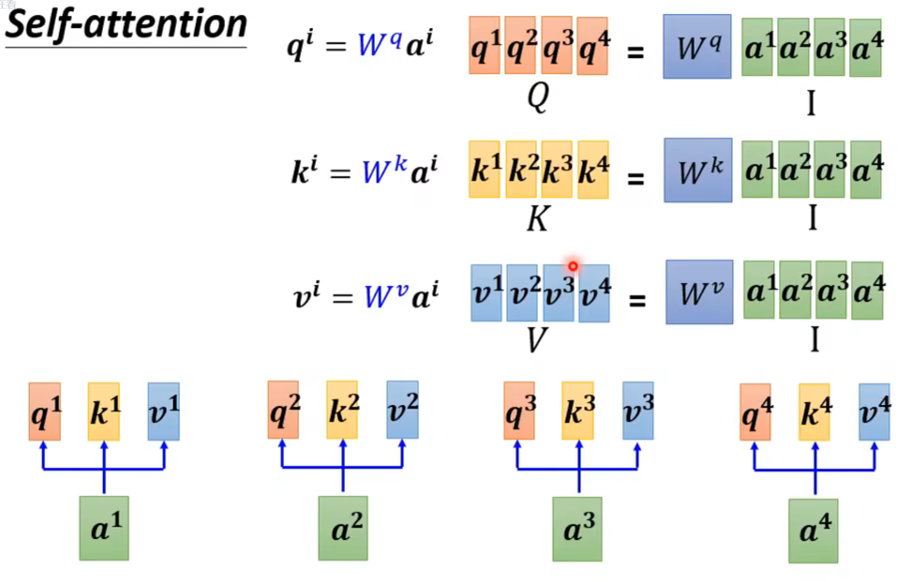

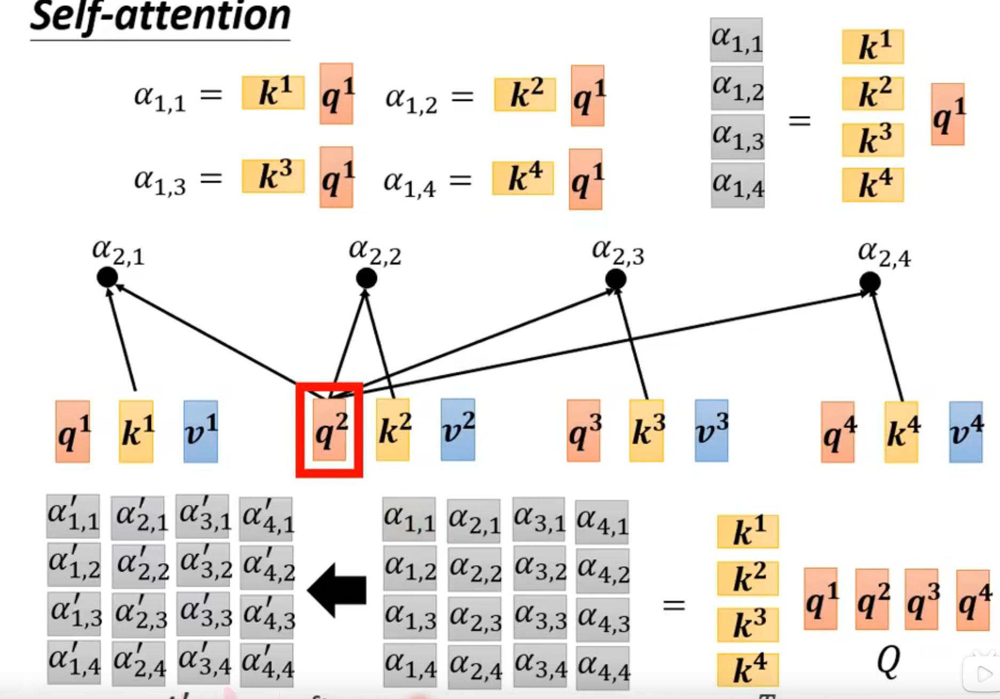

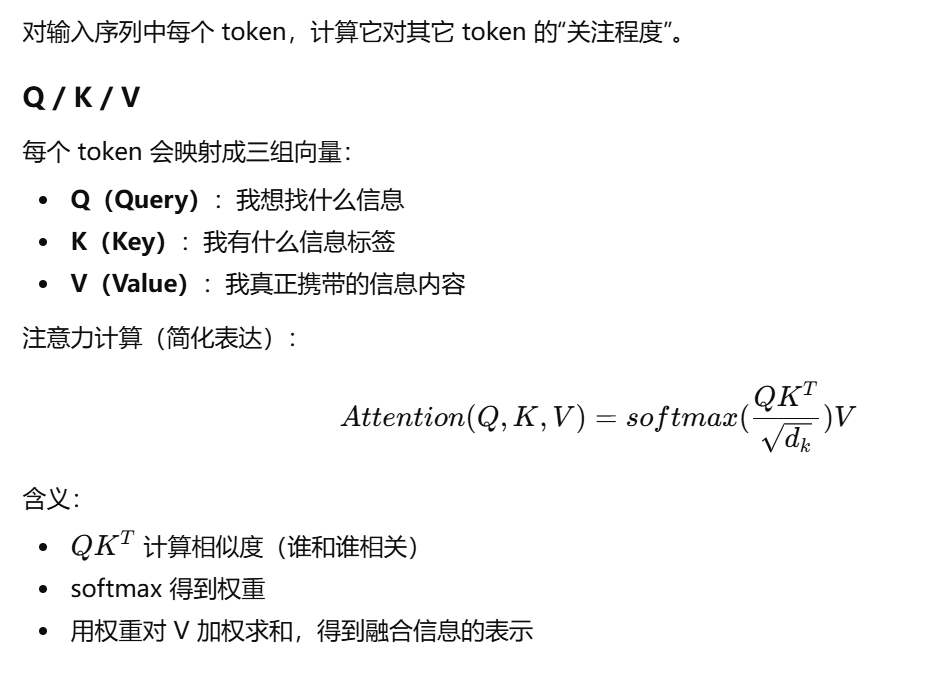
