# 题型

**选择题**: 10个,一个2分 (绪论, 评审, 单元, 集成, 系统, 验收, 工具类的)

等价类划分的原则, 几个有效, 几个无效

**解答**: 5-6个

给你一个单元程序, 能不能写出桩模块, 驱动模块

**设计**: 4个

课程章节

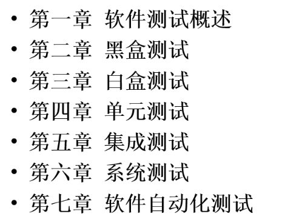

 # 等价类

等价类表示例

| **输入条件** | **有效等价类** | **唯一标识** | **无效等价类** | **唯一标识** |
| ------------ | -------------- | ------------ | -------------- | ------------ |
| …            | …              | …            | …              | …            |
| …            | …              | …            | …              | …            |
| …            | …              | …            | …              | …            |
| …            | …              | …            | …              | …            |

测试用例表

| 用例编号 | 用例数据 | 覆盖的等价类(只有等价类里面有) | 预期的输出 |
| -------- | -------- | ------------------------------ | ---------- |

做题方法

1.找到限制条件

2.划分有效和无效

3.输入测试数据覆盖等价类

- 每一个无效等价类都是不合法的
- 有效里面是且的关系
- 无效是等行的有效取反的结果(例如有效是同时含有字母和数字, 无效就是两个, (1)不含字母 (2)不含数字)

# 边界值分析

一般: 4n + 1 (min, min+ , nom, max-, max+)

健壮性: 6n + 1 (min-, min, min+, nom, max-, max, max+)

测试用例取法: 一个值取nom, 另一个值取(min, min+, nom, max- ,max), 最后会有两个nom重复, 要去掉一个, 健壮性分析同理

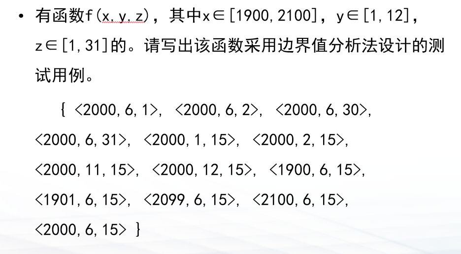

# 判定表

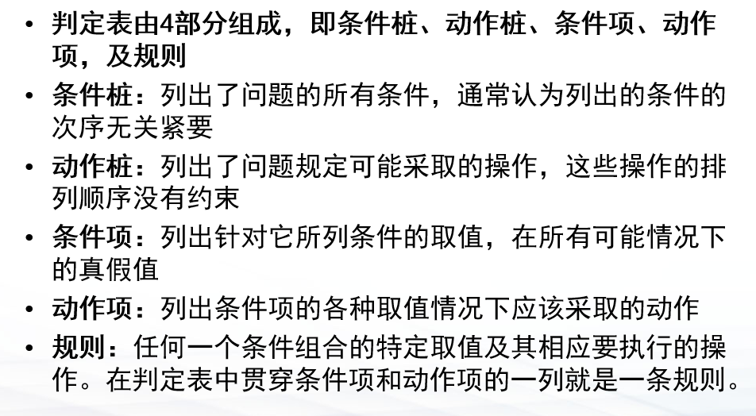

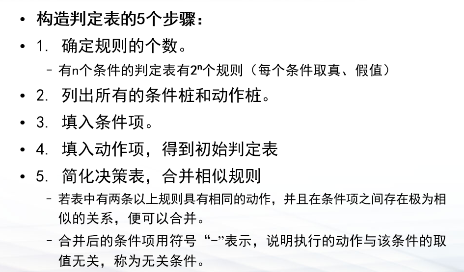

# 因果图

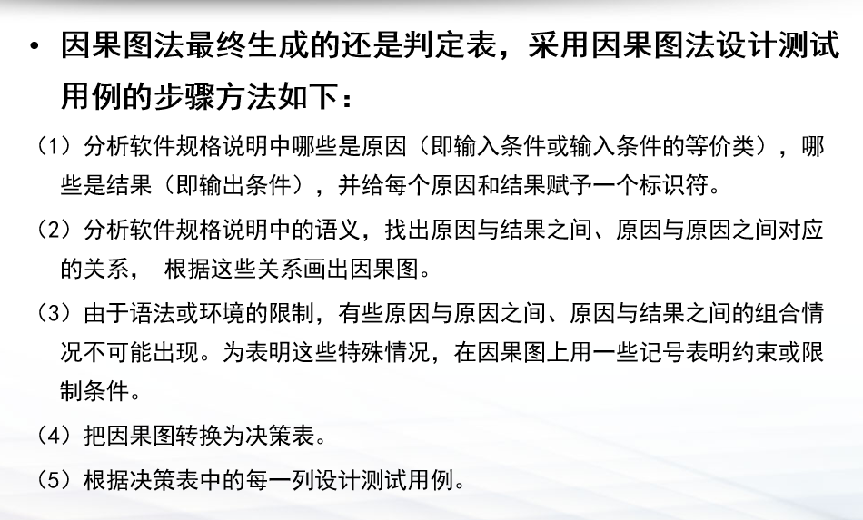

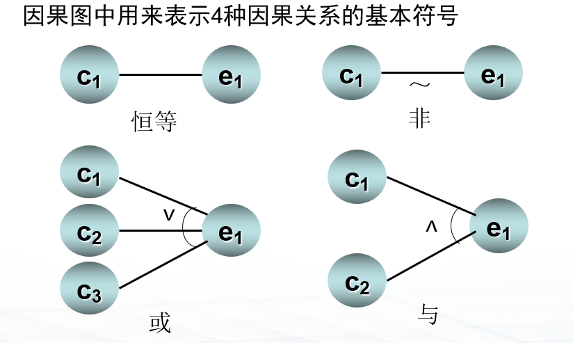

在实际问题中输入状态相互之间、输出状态相互之间可能存在某些依赖关系，称为“约束”。对于输入条件的约束有E、I、O、R四种约束，对于输出条件的约束只有M约束。

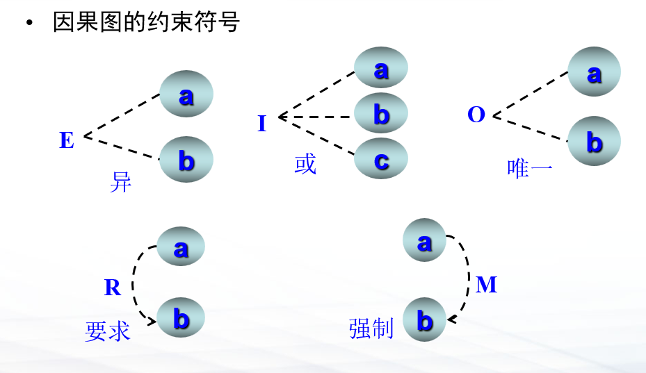

因果图中的原因数就是决策表中的条件数, 动作

# 错误推测法(选择题)

•定义：基于经验和直觉推测程序中所有可能存在的各种错误, 从而有针对性的设计测试用例的方法。

# 正交实验法

定义：正交实验设计方法是依据Galois理论,从大量的（实验）数据（测试例）中挑选适量的、有代表性的点（例）,从而合理地安排实验（测试）的一种科学实验设计方法.类似的方法有:聚类分析方法,因子方法方法等

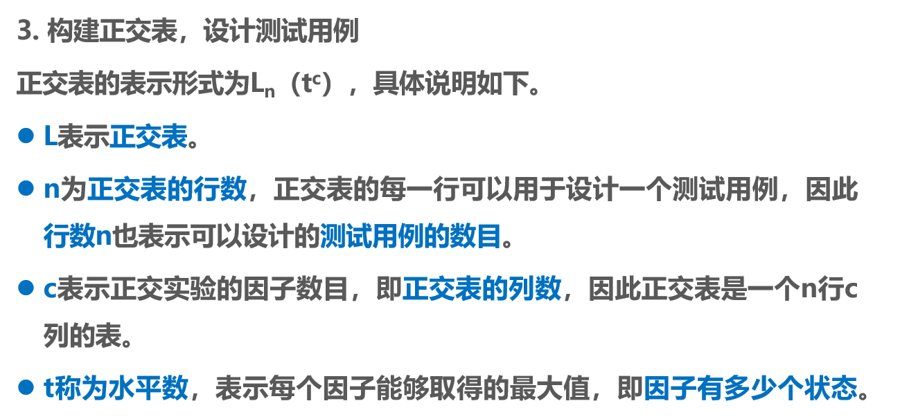

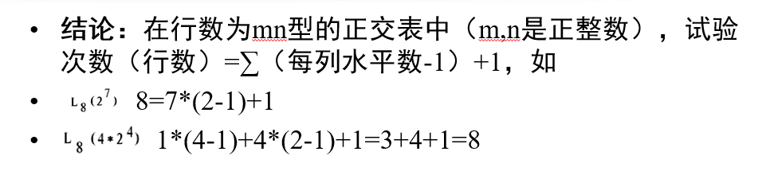

常用的正交表

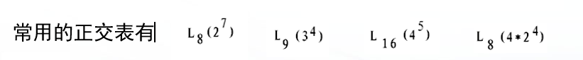

3因子2水平常用 **$L_4(2^3)$**

# 场景法

•**定义：**现在的软件都是用事件来触发流程的，事件触发时的情景并成了场景，而同一事件不同的触发顺序和处理结果就形成事件流。

基本事件流就是正确的路径, 而备选流是流程图中所有的否

基本流是一个场景, 每一个备选流都是一个场景

# 基本路径法

**设计步骤**

**1.根据模块逻辑构造控制流图（Flow Graph）**

**2.计算控制流图的环复杂度 (Cyclomatic Complexity)**

**3.列出包含起始节点和终止节点的基本路径**

**4.检查一下列出的基本路径数目是否超过控制流图的环复杂度**

**5.设计覆盖这些基本路径的测试用例**

## 环复杂度

1.**闭合区域的数目** + 1

2.边的数目-节点的数目 + 2

## 基本路径

是一条从起始节点到终止节点的路径, 至少包含一条其它基本路径没有包含的边

**注意：对于循环而言，基本路径应包含不执行循环和执行一次循环体。**

# 测试覆盖率

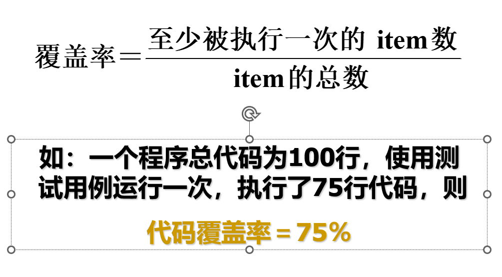

# 逻辑覆盖

根据覆盖目标的不同，逻辑覆盖又可分为语句覆盖、判定覆盖、条件覆盖、判定/条件覆盖、组合覆盖和路径覆盖。 

语句覆盖：选择足够多的测试用例，使得程序中的每个可执行语句至少执行一次。 

判定覆盖：通过执行足够的测试用例，使得程序中的每个判定至少都获得一次“真”值和“假”值， 也就是使程序中的每个取“真”分支和取“假”分支至少均经历一次，也称为“分支覆盖”。 

条件覆盖：设计足够多的测试用例，使得程序中每个判定包含的每个条件的可能取值（真/假）都至少满足一次。

判定/条件覆盖：设计足够多的测试用例，使得程序中每个判定包含的每个条件的所有情况（真/假）至少出现一次，并且每个判定本身的判定结果（真/假）也至少出现一次。

——满足判定/条件覆盖的测试用例一定同时满足判定覆盖和条件覆盖。

组合覆盖：通过执行足够的测试用例，使得程序中每个判定的所有可能的条件取值组合都至少出现一次。

——满足组合覆盖的测试用例一定满足判定覆盖、条件覆盖和判定/条件覆盖。

路径覆盖：设计足够多的测试用例，要求覆盖程序中所有可能的路径。

## 语句覆盖

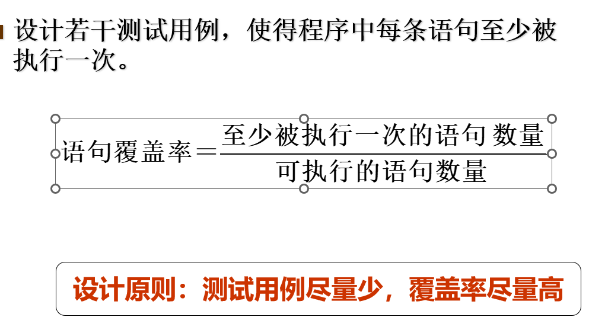

## 判定覆盖

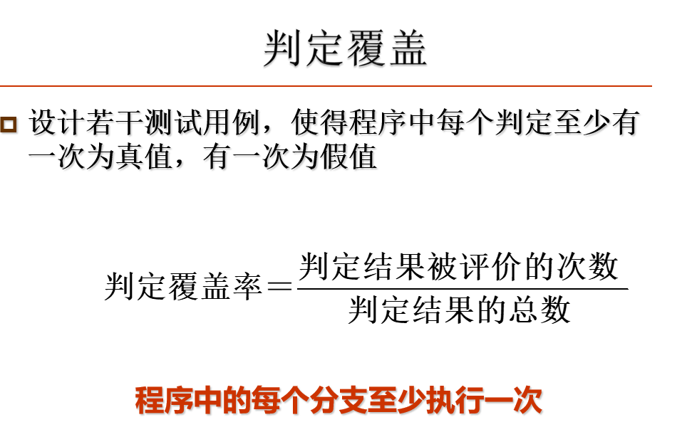

## 条件覆盖

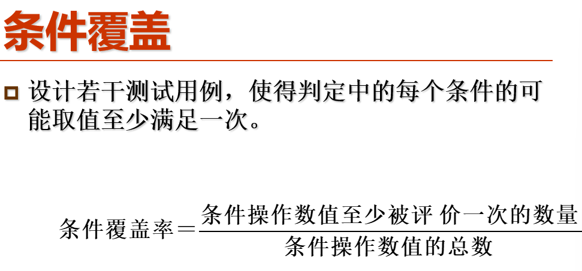

## 判定条件覆盖

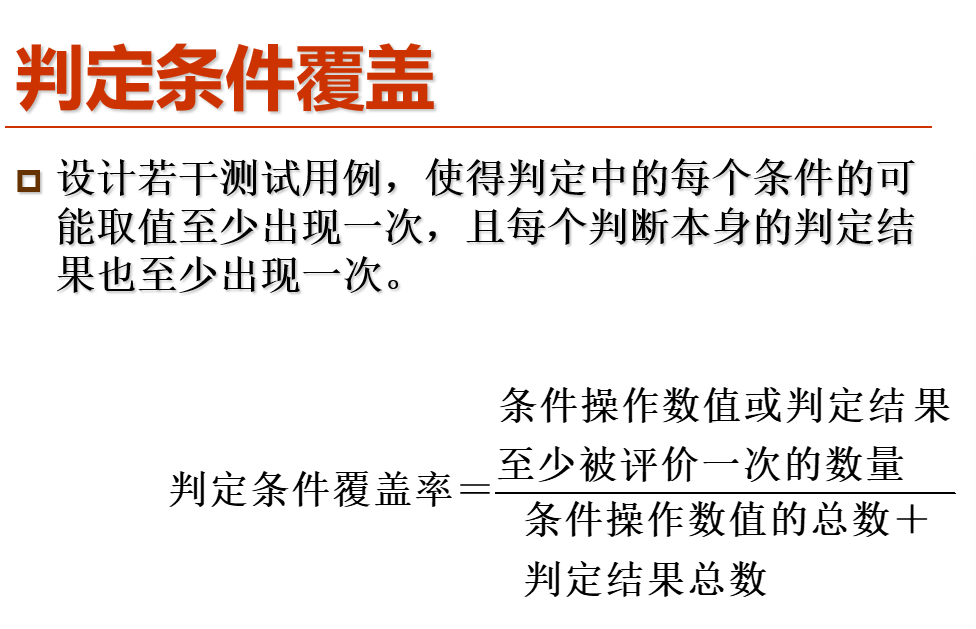

## 条件组合覆盖

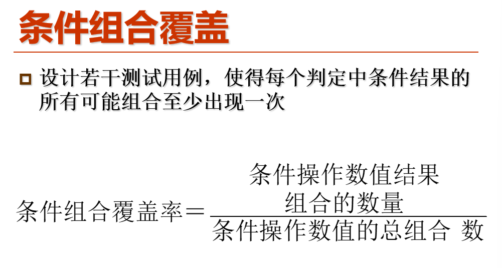

## 组合覆盖

组合覆盖的目的是要使设计的测试用例能覆盖每一个判定的所有可能的条件取值组合。

组合覆盖的测试用例个数等于流程中**最大**条件数的组合个数

## 路径覆盖

前面提到的5种逻辑覆盖都未涉及到路径的覆盖。事实上，只有当程序中的每一条路径都受到了检验，才能使程序受到全面检验。路径覆盖的目的就是要使设计的测试用例能覆盖被测程序中所有可能的路径。

# 数据流测试

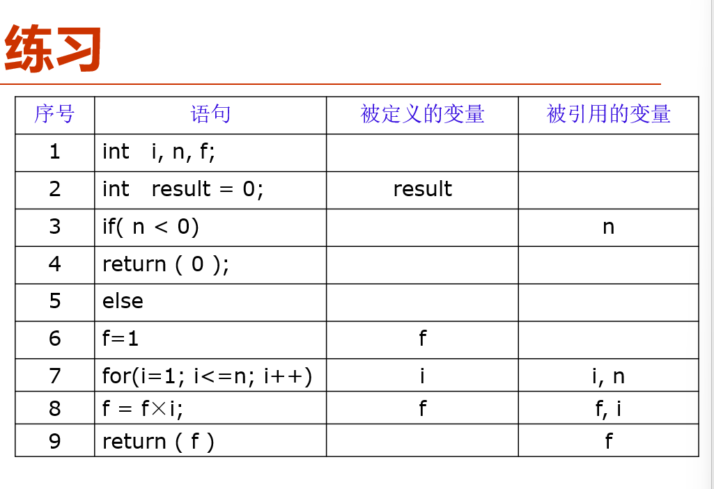

变量被初始化, 才算被定义的变量

# 程序插桩

“插桩”：通过在源代码中加入记录信息语句，以便进行运行信息的追踪和调试，统计有关的运行资源状况。
程序插桩方法：借助往被测程序中插入操作，来实现测试目的的方法，即向源程序中添加一些语句，实现对程序语句的执行、变量的变化等情况进行检查。
如print语句（最简单的插桩）
插桩技术是实现各种覆盖测试的必要手段。

# 最少测试用例数计算

把构成循环操作的重复型结构用选择结构代替

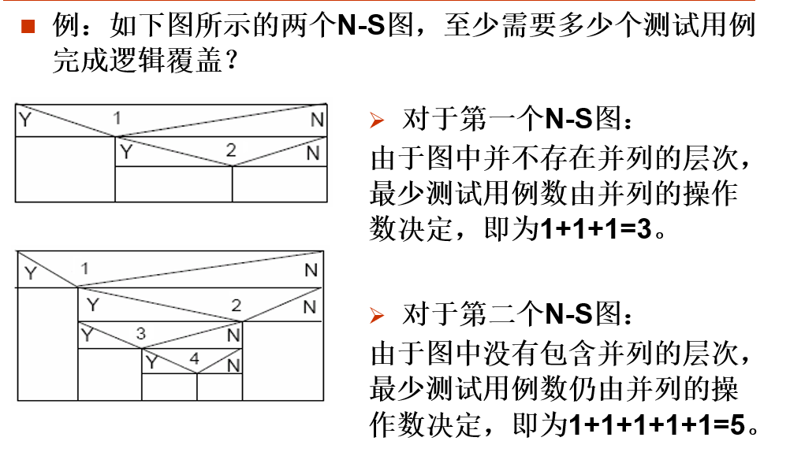

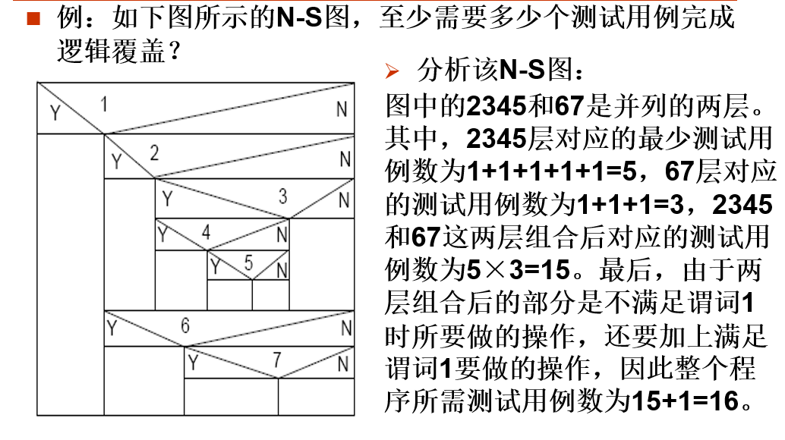

# 单元测试

•单元：一个最小的单元应有明确的功能、性能定义、   接口定义而且可以清晰地与其他单元区分开来。

•单元测试：是对软件基本组成单元进行的测试。是检验程序最小单位，即检查模块有无错误，它是在编码完成后必须进行的测试工作。

单元测试的作用

• 编写单元测试就是用来验证这段代码的行为是否与我们期望的一致。有了单元测试，我们可以自信的交付自己的代码。

单元测试进行的时机

•先编写产品函数的框架，然后编写测试函数，针对产品函数的功能编写测试用例，然后编写产品函数的代码，每写一个功能点都运行测试，随时补充测试用例。

执行单元测试的一般步骤为编译运行程序（查看能否正确运行）→静态测试（检查代码是否符合规范）→动态测试（深入检查代码的正确性，容错性和边界值等）

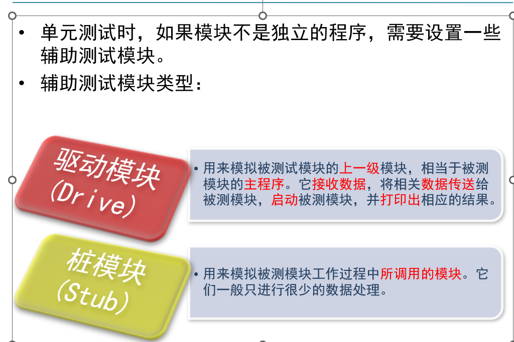

驱动模块主要完成以下事情：1、接受测试输入；2、对输入进行判断；3、将输入传给被测单元，驱动被测单元执行；4、接受被测单元执行结果，并对结果进行判断；5、将判断结果作为用例执行结果输出测试报告。
桩模块要完成以下事情：
    1、使程序编译通过
    2、模拟被代替模块各种可能值

# 集成测试

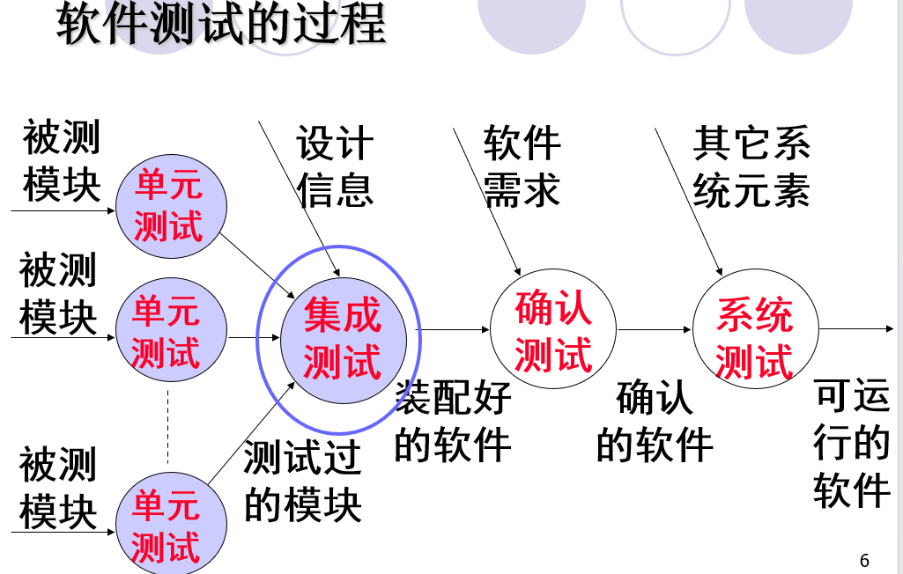

集成测试的目的:

确保各单元组合在一起后能够按既定意图协作运行，并确保增量的行为正确，所测试的内容包括单元间的接口以及集成后的功能。

## 集成策略

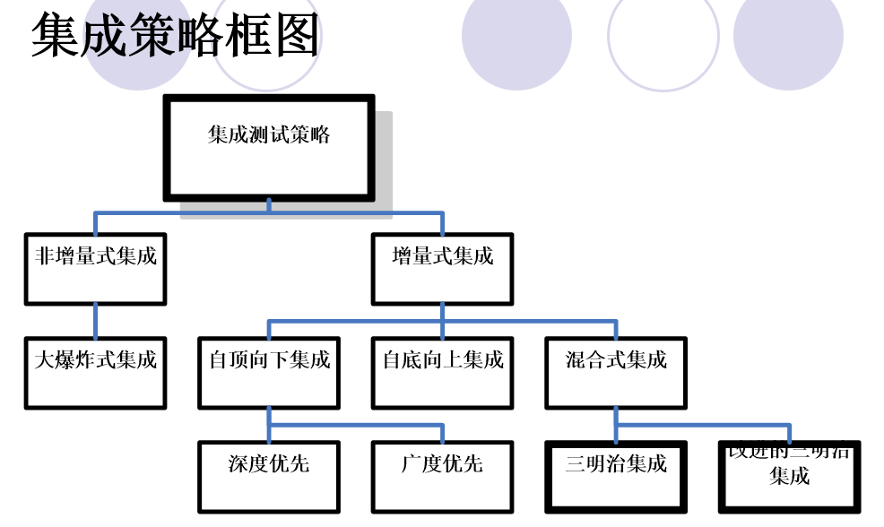

自顶向下

- 深度
- 广度

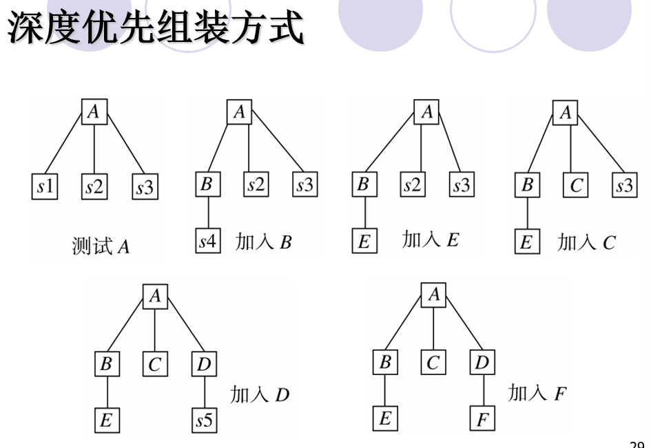

自底向上

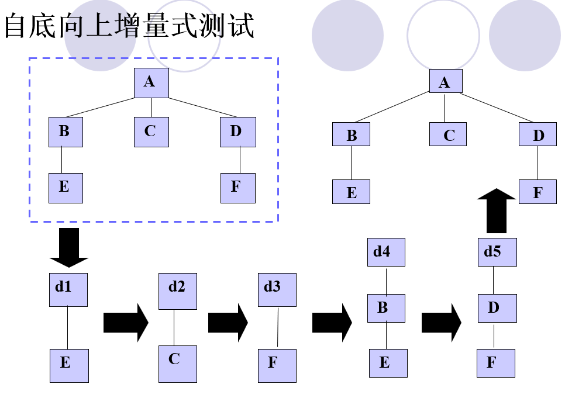

# 系统测试

主要测试方法: 黑盒测试

目的: **通过与系统的需求定义做比较，发现软件与系统定义不符合或与之矛盾的地方；系统测试的测试用例应根据需求分析说明书来设计，并在实际使用环境下运行；**

**系统测试是测试人员需要花大量时间完成的，也是软件交给用户进行验收测试前的最后一道关口。**

## 系统测试层次

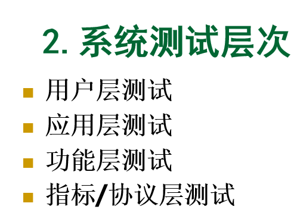

# 验收测试

验收测试的目的是确保软件准备就绪，并且可以让最终用户将其用于执行软件的既定功能和任务。即软件系统可以正式投入运行。

n验收测试的目的主要是验证软件功能的正确性和需求的符合性。

n验收测试用例所覆盖的范围应该只是软件功能的子集，而不是软件的所有功能。

n验收测试用例应当是粗粒度的、结构简单的、条理清晰的，而不应当过多地描述软件内部实现的细节。

n验收测试用例的组织应当面向客户，从客户使用和业务场景的角度出发，而不是从开发者实现的角度出发。

设计验收测试用例应当充分把握客户的关注点。

# α测试**与**β测试

在软件交付使用后，用户将如何使用软件对开发者来说是无法预测的，当软件是为特定用户开发的，可以通过一系列验证测试去验证用户需求是否已经得到满足，但是对于为多用户开发的商业软件产品，每个用户都对软件进行验收测试是不切实际的，很多软件产品生产者采用α测试和β测试 去发现只有最终用户才能发现的错误。

α测试目的是评价软件产品的FLURPS（功能、局域化、可使用性、可靠性、性能和支持）。

α测试是由用户在开发环境下进行的测试，也可以是公司内部的用户在模拟实际操作环境下进行的测试。

开发者可以坐在用户旁边，随时记录用户使用中的错误和修改建议，是在受控制的环境下进行的测试 。

α测试人员是除开发人员外首先见到产品的人，他们提出的功能和界面的修改意见是非常有价值的。

α测试可以在编码结束后就开始，但是为了保障测试的效果，最好在软件达到一定稳定性和可靠性之后再开始进行测试。

β测试是由软件的多个用户在一个或多个用户的实际使用环境下进行的测试。

与α测试不同的是，开发者通常不在测试现场 。β测试是在开发者无法控制的环境下进行的软件现场应用。

参与β测试的用户记录下在软件使用过程中遇到的问题，包括客观问题及主观建议，并定期向开发者报告，开发者采纳其中合理的建议，并进行相应修改。

只有当α测试达到一定可靠程度后，才能够开始β测试。

由于β测试发生在测试的最后阶段，所以不能指望β测试能够发现主要的问题。

# V模型

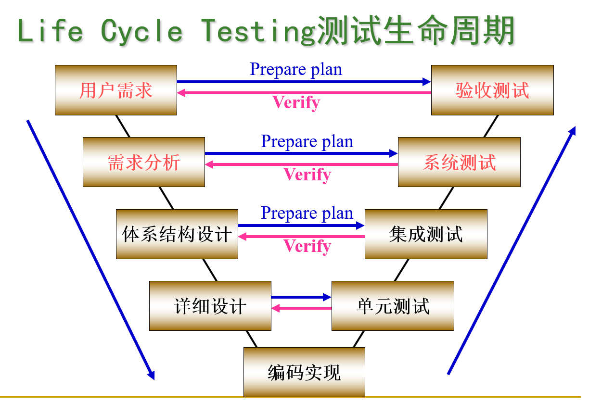
