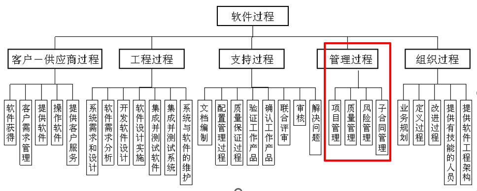
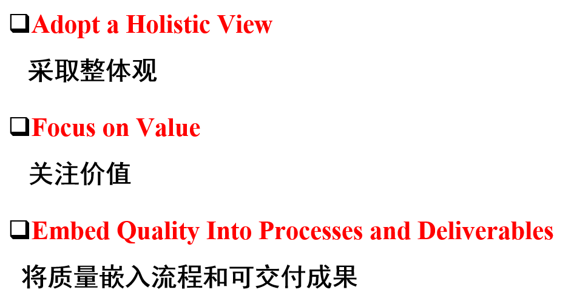
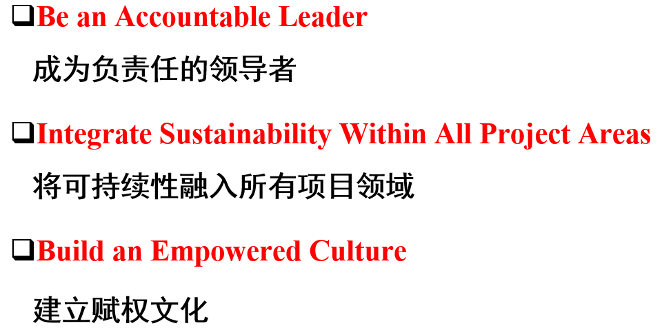
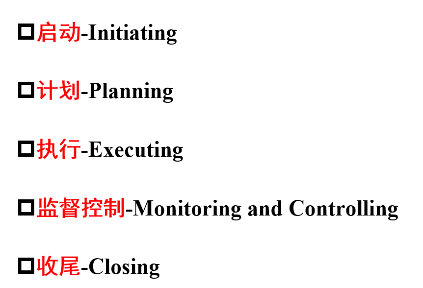
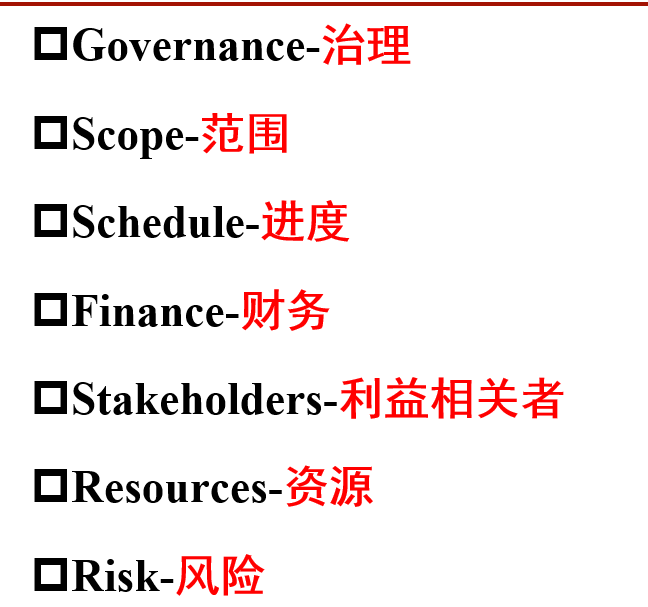
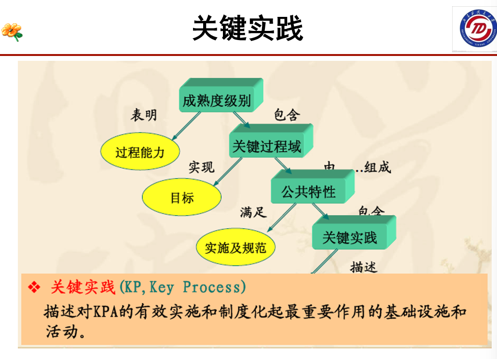
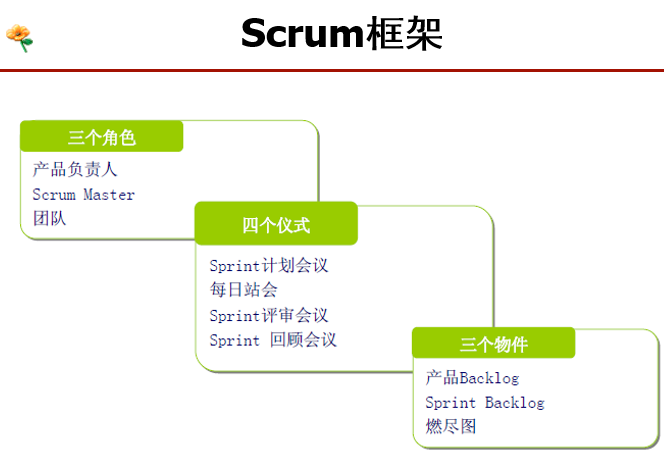
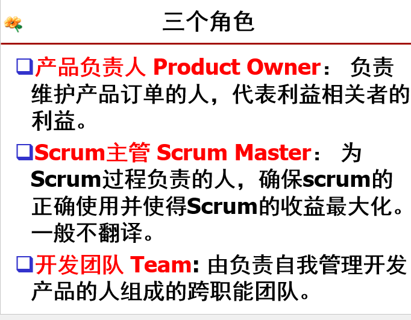
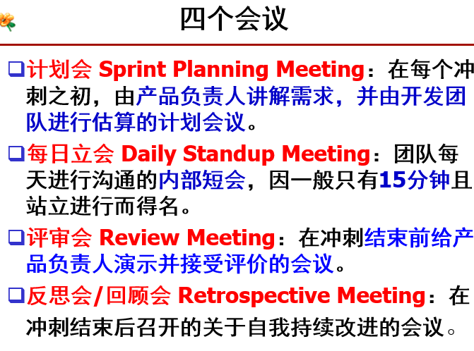
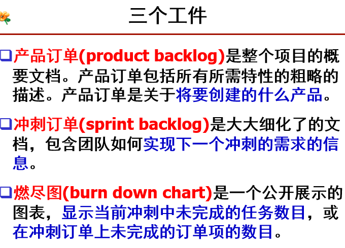

 软件过程与管理 期末复习题及答案

---

## 概论

### 软件工程的三要素

**答案：**

软件工程以关注软件质量为目标，包括过程、方法和工具三个要素。

- **过程（Process）**：支持软件生命周期的所有活动
- **方法（Methods）**：为软件开发过程提供"如何做"的技术
- **工具（Tools）**：为软件开发方法提供自动的或半自动的软件支撑环境

> **来源：** 第一讲 PPT Slide 45

---

### 软件过程的定义

**答案：**

SEI（Software Engineering Institute）对软件过程的定义：

> **软件过程是用于软件开发及维护的一系列活动、方法及实践。**
> *The software process is the set of tools, methods and practices we use to produce a software product.*
>
> —— Watts Humphrey, *Managing the Software Process*, 1989

> **来源：** 第一讲 PPT Slide 53（SEI定义）

---

### 常见的软件过程分类。常见的软件过程。

**答案：**



工程过程是软件系统、产品的定义、设计、实现以及维护的过程

支持过程为工程过程提供支撑，包括文档编制、配置管理过程、质量保证过程、验证工作产品、确认工作产品、联合评审、审核、解决问题。

管理过程是在整个软件生命周期中为工程过程、支持过程和客户-供应商过程的实践活动提供指导、跟踪和监控的过程。

常见的软件过程:  工程过程, 支持过程, 管理过程

---

## 软件质量管理

### 软件质量的定义

**答案：**

> **软件质量是软件产品满足明确或隐含需要能力的性能和特性的总体。**
> *The totality of features and characteristics of a software product that bear on its ability to satisfy stated or implied needs.*

- **用户需求是衡量软件质量的基础**。
- 除满足明确定义的需求外，还要满足**隐含的需求**。

> **来源：** 第二讲（软件质量）PPT Slide 8（ISO定义）

---

### ISO/IEC 25010:2023 软件质量模型的九个一级质量特性及对应的二级特性

**答案：**

ISO/IEC 25010:2023 软件质量模型由**9个一级质量特性**和**40个二级质量特性**组成。

| 序号 | 一级特性                                 | 二级特性（数量）                                             |
| :--: | ---------------------------------------- | ------------------------------------------------------------ |
|  1   | **功能适用性（Functional suitability）** | 功能完备性、功能正确性、功能适合性（3个）                    |
|  2   | **性能效率（Performance efficiency）**   | 时间特性、资源利用性、容量（3个）                            |
|  3   | **兼容性（Compatibility）**              | 共存性、互操作性（2个）                                      |
|  4   | **交互能力（Interaction capability）**   | 可辨识性、易学性、易操作性、用户差错防御性、用户粘性、包容性、用户支持、自描述性（8个） |
|  5   | **可靠性（Reliability）**                | 无故障性、可用性、容错性、易恢复性（4个）                    |
|  6   | **信息安全（Security）**                 | 保密性、完整性、抗抵赖性、可核查性、真实性、耐受性（6个）    |
|  7   | **可维护性（Maintainability）**          | 模块化、可重复使用性、可分析性、可修改性、可测试性（5个）    |
|  8   | **灵活性（Flexibility）**                | 适应性、可扩展性、可安装性、可替换性（4个）                  |
|  9   | **系统安全（Safety）**                   | 运行限制、风险识别、故障安全、危险警告、安全集成（5个）      |

> **来源：** 第二讲（软件质量）PPT Slides 29-61 + ISO/IEC 25010:2023 标准

#### ISO 软件质量模型的发展历程

- ISO/IEC 9126: 1991（最早版本）
- ISO/IEC 9126-1: 2001
- ISO/IEC 25010: 2011
- **ISO/IEC 25010: 2023**（2023-11-15 最新版本）

模型由三层组成：软件质量特性 → 软件质量子特性 → 软件质量度量评价准则

> **来源：** 第二讲 PPT Slide 27

---

### 朱兰质量管理三部曲

**答案：**

约瑟夫·莫西·朱兰（Joseph M. Juran）提出的**朱兰质量三部曲（Juran Trilogy）** 包括三个核心管理过程：

1. **质量设计（Quality Planning）**：确定客户需求，开发满足这些需求的产品和过程。
2. **质量控制（Quality Control）**：评估实际绩效，与目标对比，并采取行动纠正差异。
3. **质量改进（Quality Improvement）**：建立基础设施，识别改进机会，并推动变革以实现突破性提升。

朱兰的观点：质量的本质内涵是"**适用性**"，即产品在使用期间能满足使用者的需求；80/20原则——质量问题20%来源于基层操作人员，80%来源于管理者。

> **来源：** 第一讲 PPT Slides 69-70；百度百科

---

## 软件项目管理

### 基本概念：项目、项目管理、项目管理的六大原则、五个焦点领域和七个绩效域

#### 项目（Project）的定义

> 一项在独特环境中进行的临时性、独特性活动，旨在创造价值。

核心特征：

- **临时性**：有明确的起点和终点
- **独特性**：产品、服务或成果是独特的
- **渐进明细**：随着信息越来越详细，规划逐步细化

#### 项目管理（Project Management）的定义

> 将知识、技能、工具与技术应用于项目活动，以满足或超越预期的价值。

#### 项目管理的六大原则





#### 五个焦点领域（五大过程组）



#### 七大绩效域（PMBOK 第八版）



---

### 可行性分析：净现值的优点

净现值是成本效益分析的有力工具之一

---

### 识别软件项目的活动：WBS

**答案：**

#### WBS（Work Breakdown Structure，工作分解结构）的定义

> WBS 是面向可交付成果的对项目任务的分组，它组织并定义了整个项目范围。它是一个分级的树型结构，是对项目由粗到细的分解过程。

#### WBS 的核心要点

- **层次关系**：上下层次之间的关系明确
- **分解深度**：一般 3-5 层
- **叶子节点**：只有最底层的叶子节点构成了项目的活动集合
- **渐进细化**：WBS 可以随着项目的进展而细化

---

### 软件工作量估计方法

#### 常见的软件工作量估计方法

| 方法                      | 说明                                       |
| ------------------------- | ------------------------------------------ |
| **① 专家判断**            | 依靠领域专家的经验和直觉进行估计           |
| **② 类比估计**            | 参照已完成类似项目的实际数据来估计当前项目 |
| **③ 自底向上**            | 将项目分解为多个小任务，分别估计后汇总     |
| **④ 自顶向下**            | 从整体项目出发，按比例分解到各组成部分     |
| **⑤ Albrecht 功能点分析** | 基于功能点（FP）的度量方法                 |
| **⑥ Mark II 功能点**      | 另一种功能点分析方法                       |
| **⑦ COSMIC 全功能点**     | 第二代功能点度量方法                       |
| **⑧ COCOMO II**           | 参数化的生产率模型                         |

#### IFPUG 功能点方法中信息系统的五大类功能

IFPUG（国际功能点用户组）将功能分为以下五大类：

| 类别                    | 英文                    | 说明                                                 |
| ----------------------- | ----------------------- | ---------------------------------------------------- |
| **外部输入（EI）**      | External Input          | 更新内部计算机文件的输入事务                         |
| **外部输出（EO）**      | External Output         | 从内部计算机文件中提取并显示数据的事务，通常包含报表 |
| **外部查询（EQ）**      | External Inquiry        | 用户发起的事务，提供信息但不更新内部文件             |
| **内部逻辑文件（ILF）** | Internal Logical File   | 系统创建和访问的数据存储（相当于数据存储）           |
| **外部接口文件（EIF）** | External Interface File | 从其他应用程序维护的数据存储中检索数据               |

---

### 软件项目的进度安排

#### 甘特图（Gantt Chart）

- 由 Henry Laurence Gantt（1861-1919）发明
- 以条形图形式展示项目活动的时间进度
- **缺点**：无法描述任务之间的逻辑关系

#### 关键路径法（CPM，Critical Path Method）

**活动-节点（Activity-on-Node）网络：**

- 活动用节点表示，连接表示活动的次序
- 一个网络只有一个开始节点和一个结束节点
- 节点有周期，连接没有周期
- 时间从左边流向右边，不能有回路和悬挂

**节点信息：**

```
┌─────────────────┐
│ 活动编号/描述    │
│ 周期             │
│ ES（最早开始）   │
│ EF（最早完成）   │
│ LS（最晚开始）   │
│ LF（最晚完成）   │
│ Float（缓冲期）  │
└─────────────────┘
```

- EF = ES + 周期
- LS = LF - 周期

**计算步骤：**

1. **正向遍历（Forward Pass）**：计算每个活动的 ES 和 EF
2. **逆向遍历（Backward Pass）**：计算每个活动的 LS 和 LF
3. **计算缓冲期（Float）**：Float = LS - ES（或 LF - EF）
4. **确定关键路径**：Float = 0 的活动组成的路径

**缓冲期分类：**

- **总缓冲期**：LS - ES（或 LF - EF）
- **空闲缓冲期（Free Float）**：活动最早的完成日期与后续活动最早的开始日期之间的差
- **干预缓冲期（Interfering Float）**：总缓冲期 - 空闲缓冲期

> **来源：** 第九讲-关键路径法 PPT

#### 关键链法（CCPM，Critical Chain Project Management）

**核心思想：** 由 Eliyahu Goldratt 基于约束理论（TOC）提出，同时考虑**工序依赖**和**资源约束**。

**计算步骤：**

1. **识别资源约束**：找出项目系统的瓶颈资源
2. **制定初始进度计划**：以最乐观时间进行计划，剔除各工序中隐藏的安全时间，确定关键链
3. **插入三类缓冲**：
   - **项目缓冲（PB）**：关键链末端，保护项目总工期
   - **接驳缓冲（FB）**：非关键链与关键链交汇处
   - **资源缓冲（RB）**：关键链工序前，确保资源及时到位
4. **缓冲大小计算**：常用剪切-粘贴法或根方差法
5. **通过缓冲监控控制项目**：采用三色管理法（绿/黄/红）监控缓冲消耗率
6. **持续改进**：识别新的约束资源，循环改进

> **来源：** 关键链项目管理理论（Goldratt, 1997）

#### PERT 技术（Program/Evaluation and Review Technique）

**与 CPM 的区别：** PERT 将不确定性引入进度管理，对活动周期进行三次估计。

**计算步骤：**

1. **三次估计**每个活动的时间：
   - 乐观时间（a）：期望完成任务的最短时间
   - 最可能时间（m）：正常情况下所花的时间
   - 悲观时间（b）：最坏可能时间

2. **计算期望周期和标准偏差**：
   - 期望周期：`te = (a + 4m + b) / 6`
   - 标准偏差：`s = (b - a) / 6`

3. **正向遍历**得到期望达到事件的日期

4. **计算满足目标的可能性**：
   - 计算项目事件的标准偏差
   - 计算 z 值：`z = (T - te) / s`
   - 将 z 值转化为概率

**PERT 的优点：**

- 活动的标准差是风险的一种度量
- 可以估计项目事件完成日期的概率

> **来源：** 第十讲-风险管理与PERT PPT Slides 33-49

---

### 软件项目的资源管理

#### 资源定义

项目资源是指执行项目活动所需的人员、设备、材料、资金等。在软件项目中，资源主要指**人力资源**（开发人员、测试人员、管理人员等），也包括软件工具、硬件设备等。

#### 资源分配直方图（Resource Histogram）

**资源分配直方图**是一种以垂直柱状图形式展示项目各时间段所需资源数量的可视化工具。

- **作用**：识别资源需求的波峰与波谷，帮助进行资源平衡（Resource Levelling）和资源平滑（Resource Smoothing）
- **X轴**：时间（天/周/月）
- **Y轴**：资源数量（通常为人时/人天）
- 超出可用资源线的部分表示**资源过度分配**，需要调整

> **来源：** 项目管理理论与 PMBOK 指南

---

### 软件项目的风险管理

#### 风险的定义（PMBOK）

> **风险**是一个不确定的事件或者情况，若其一旦发生，会对项目的目标（如范围、进度、成本和质量）产生积极或消极的影响。

**风险的三要素：** 事件、事件发生的概率、事件的影响

**风险的基本性质：** 客观性、不确定性、不利性、可变性、相对性、风险与利益的对称性

#### 风险管理的框架

| 步骤                       | 内容                   | 常用方法                                            |
| -------------------------- | ---------------------- | --------------------------------------------------- |
| **① 风险识别**             | 识别项目可能有哪些风险 | 检查单、头脑风暴、德尔菲法                          |
| **② 风险分析与优先级排序** | 哪些是最严重的风险     | 定量分析（货币/时间量化）、定性分析（概率影响矩阵） |
| **③ 风险策划**             | 对风险采取什么措施     | 接受、规避、降低、转移                              |
| **④ 风险监督**             | 风险当前状态如何       | 跟踪风险记录单                                      |

#### 风险处理的方法

| 方法         | 说明                           | 举例                     |
| ------------ | ------------------------------ | ------------------------ |
| **接受风险** | 回避风险的成本可能大于实际损失 | 小概率低影响风险         |
| **规避风险** | 避免风险发生的环境             | 放弃采用新技术           |
| **降低风险** | 采取措施降低风险发生概率或影响 | 用原型法降低需求错误风险 |
| **转移风险** | 将风险转移给他人或组织         | 外包中间产品、购买保险   |

> **来源：** 第十讲-风险管理与PERT PPT Slides 2-31

---

### 软件项目的监督和控制：挣值分析

**答案：**

**挣值分析（Earned Value Analysis, EVA）** 是一种综合了范围、进度和成本的绩效测量方法。

#### 三个基本值

| 指标    | 英文                             | 含义                                     |
| ------- | -------------------------------- | ---------------------------------------- |
| **PV**  | Planned Value（计划价值）        | 截至某时间点，计划要完成的工作的预算价值 |
| **EV**  | Earned Value（挣值）             | 截至某时间点，实际完成工作的预算价值     |
| **AC**  | Actual Cost（实际成本）          | 截至某时间点，实际已经花费的成本         |
| **BAC** | Budget at Completion（完工预算） | 完成整个项目的总预算                     |

#### 偏差分析

| 指标               | 公式         | 含义             | 判断                     |
| ------------------ | ------------ | ---------------- | ------------------------ |
| **SV**（进度偏差） | SV = EV - PV | 进度超前还是滞后 | SV > 0 超前；SV < 0 滞后 |
| **CV**（成本偏差） | CV = EV - AC | 成本节约还是超支 | CV > 0 节约；CV < 0 超支 |

#### 绩效指数

| 指标                    | 公式          | 含义                       | 判断                       |
| ----------------------- | ------------- | -------------------------- | -------------------------- |
| **SPI**（进度绩效指数） | SPI = EV / PV | 实际进度是计划进度的百分比 | SPI > 1 超前；SPI < 1 滞后 |
| **CPI**（成本绩效指数） | CPI = EV / AC | 每花一元钱做了多少钱的事   | CPI > 1 节约；CPI < 1 超支 |

> **来源：** 项目管理理论 / PMBOK® 指南

---

### 软件项目的配置管理

#### 配置管理的任务

软件配置管理（SCM）的主要任务包括四大核心活动：

1. **配置识别（配置标识）**：将软件项目中需要控制的部分拆分成配置项（CI），建立唯一标识
2. **配置控制（变更控制）**：对配置项和基线的变更进行控制，包括标识、记录、分析、批准/拒绝变更申请
3. **配置状态报告（配置状态统计）**：及时、准确地给出配置项的当前状况
4. **配置审计（配置审核）**：验证配置项对配置标识的一致性，确保变更需求已被切实实现

#### 配置项（Configuration Item, CI）

**配置项**是软件过程的输出信息中，所有需要纳入配置管理范畴的工作成果。

**分类：**

- **基线配置项**：需求文档、设计文档、源代码、测试用例等
- **非基线配置项**：各类计划、报告等管理过程中产生的文档

**配置项的三种状态：** 草稿（0.YZ）→ 正式发布（X.Y）→ 正在修改（X.Y.Z）

#### 基线（Baseline）

**基线**是已经正式通过评审批准的某规约或产品，可作为进一步开发的基础。

三种基线：

- **功能基线**：系统设计规格说明
- **分配基线**：软件需求规格说明
- **产品基线**：全部配置项的规格说明

> **来源：** 软件配置管理理论 / IEEE 标准 / 百度百科

---

## 经典的软件过程管理

### CMM/CMMI

#### CMM：出发点，体系结构，关键过程域，关键实践活动

**出发点：**

CMM（Capability Maturity Model，软件能力成熟度模型）是卡耐基-梅隆大学软件工程研究所（SEI）为了满足美国联邦政府评估软件供应商能力的要求，于1986年开始研究的模型，1991年正式推出 CMM 1.0 版。

CMM 描述一条从**无序的、混乱的过程**到**成熟的、有纪律的过程**的改进途径。

**体系结构：**

CMM 由**5个成熟度级别**组成。每个成熟度级别（除级别1）包含了实现该级别的若干个**关键过程域（KPA）**。每一个 KPA 进一步被分为称为**公共特征**的5个部分，这些公共特征包括了**关键实践（KP）**。

```
成熟度等级 → 关键过程域(KPA) → 公共特征(5类) → 关键实践(KP)
```

**CMM 的五个成熟度等级：**

| 等级 | 名称                   | 特征                                       |
| :--: | ---------------------- | ------------------------------------------ |
|  1   | 初始级（Initial）      | 无序、混乱的过程，成功依赖个人             |
|  2   | 可重复级（Repeatable） | 建立了基本的项目管理过程，可重复以往的成功 |
|  3   | 已定义级（Defined）    | 管理和工程活动已标准化、文档化             |
|  4   | 已管理级（Managed）    | 对过程和产品进行定量度量和控制             |
|  5   | 已优化级（Optimizing） | 持续的过程改进，预防缺陷                   |

**CMM 的 18 个关键过程域（KPA）：**

|        等级         | 关键过程域                                                   |
| :-----------------: | ------------------------------------------------------------ |
| 2级（可重复级·6个） | 需求管理、软件项目计划、软件项目跟踪与监控、软件转包合同管理、软件质量保证、软件配置管理 |
| 3级（已定义级·7个） | 组织过程焦点、组织过程定义、培训程序、集成软件管理、软件产品工程、组间协调、同级评审 |
| 4级（已管理级·2个） | 定量过程管理、软件质量管理                                   |
| 5级（已优化级·3个） | 缺陷防范、技术改革管理、过程变更管理                         |

**五个公共特征（关键实践分类）：**



| 公共特征         | 说明                                   |
| ---------------- | -------------------------------------- |
| ① **执行约定**   | 制定组织策略和构建领导体制             |
| ② **执行能力**   | 满足前提条件（组织机构、资源、培训等） |
| ③ **执行活动**   | 执行必需的活动、任务、职责分配和规程   |
| ④ **测量与分析** | 确定、控制和改进软件过程的状态         |
| ⑤ **验证实施**   | 通过评审和监督确保遵循过程步骤         |

> **来源：** 第十三讲_CMM PPT。CMM 不是过程、技术或方法，而是一种理念和指导思想，说明"做什么"而非"如何做"。

#### CMMI 与 CMM 的区别和联系，CMMI 的两种表示方法

**区别与联系：**

| 维度     | CMM                       | CMMI                                                       |
| -------- | ------------------------- | ---------------------------------------------------------- |
| 全称     | Capability Maturity Model | Capability Maturity Model **Integration**                  |
| 范围     | 仅关注软件工程            | 集成系统工程、软件工程、集成产品开发、供应商来源等多个学科 |
| 表示法   | 阶段式                    | 阶段式 + 连续式                                            |
| 结构     | 5个等级                   | 阶段式：5个成熟度等级；连续式：6个能力等级                 |
| 学科集成 | 单一学科                  | 多学科无缝集成                                             |

**联系：** CMMI 是 CMM 的改进和集成，由 SEI 开发。CMMI 的理论来源于 SW-CMM V2.0、EIA 731（SECM）和 IPD-CMM。

**CMMI 的两种表示方法：**

| 表示法                   | 说明                                                     | 优点                   |
| ------------------------ | -------------------------------------------------------- | ---------------------- |
| **阶段式（Staged）**     | 将过程域分配到5个成熟度等级，组织按等级逐步改进          | 提供预定义的改进路线图 |
| **连续式（Continuous）** | 由过程域及其对应的能力等级构成，可选择特定过程域独立改进 | 提供最大的改进灵活性   |

**阶段式的成熟度等级：** 1-初始级 → 2-已管理级 → 3-已定义级 → 4-定量管理级 → 5-优化级

**连续式的能力等级（6个）：** 0-不完善的 → 1-已执行的 → 2-已管理的 → 3-已定义的 → 4-已定量管理的 → 5-优化

> **来源：** 第十四讲_CMMI PPT

---

### PSP（Personal Software Process）

#### 结构

PSP（个体软件过程）是一种可用于控制、管理和改进个人工作方式的自我持续改进过程。PSP 是一个包括软件开发表格、指南和规程的结构化框架。

**PSP 成熟度模型的4个等级、7个台阶：**

| 等级  | 名称             | 核心内容                                 |
| :---: | ---------------- | ---------------------------------------- |
| PSP 0 | 个体度量过程     | 计划、开发、总结三个阶段，记录时间和缺陷 |
|       |                  |                                          |
| PSP 1 | 个体计划过程     | 软件规模估计、测试报告                   |
|       |                  |                                          |
| PSP 2 | 个体质量管理过程 | 设计评审、代码评审                       |
|       |                  |                                          |
| PSP 3 | 个体循环过程     | 循环开发                                 |

**PSP 基本原则：**

- 一个软件系统的质量取决于它最差的组件的质量
- 一个软件组件的质量取决于开发它的个体
- 一个软件组件的质量取决于开发它所使用的过程的质量
- 每个人都是不同的，PSP 帮助工程师找到最适合自己的方法

#### 两种日志

1. **时间记录日志（Time Log）**：记录每个阶段花费的时间
2. **缺陷记录日志（Defect Log）**：记录每个阶段引入和排除的缺陷

#### 评审比测试有效的原因

- **测试消除缺陷的步骤**：发现异常行为 → 理解程序 → 调试定位 → 修改 → 回归测试（步骤多，效率低）
- **评审消除缺陷的步骤**：遵循评审者逻辑理解程序 → 发现缺陷同时知道位置和原因 → 修正（步骤少，效率高）
- 经过培训，评审者可以在测试之前发现并消除**80%左右**的缺陷
- 缺陷发现得越早，修复成本越低（后期修复成本是前期的10倍以上）

#### 四个设计模板

| 模板                    | 英文                               | 功能                                         | 类型 |
| ----------------------- | ---------------------------------- | -------------------------------------------- | ---- |
| **操作规格模板（OST）** | Operational Specification Template | 描述系统与外界的交互（正常和异常情况）       | 动态 |
| **功能规格模板（FST）** | Functional Specification Template  | 描述系统与外界的接口（类、关系、属性和方法） | 静态 |
| **状态规格模板（SST）** | State Specification Template       | 精确定义程序的所有状态、状态转换及动作       | 动态 |
| **逻辑规格模板（LST）** | Logical Specification Template     | 精确描述系统的内部逻辑状态（一般用伪代码）   | 静态 |

> **来源：** 第十四/十五讲_PSP PPT

---

### MSF（Microsoft Solution Framework）

#### 六个角色（组队模型）

| 角色         | 职责                                                         |
| ------------ | ------------------------------------------------------------ |
| **产品管理** | 了解用户商业特征，明确用户需求，管理客户期望，协调 Beta 测试与产品发布 |
| **程序管理** | 制定项目计划，识别并排除风险，跟踪项目状态，管理规格说明，设定出货日期 |
| **开发**     | 参与需求分析与计划制定，负责代码开发、原型实现、内部版本构建 |
| **测试**     | 负责代码测试，定位错误，掌握错误状态，执行测试并报告结果     |
| **用户体验** | 设计友好用户界面，制定培训策略，创建文档和课程材料           |
| **发布管理** | 将产品商品化，部署到实际运行环境，制定发布计划，管理发布过程 |

#### 过程模型中的五个阶段

|    阶段    | 核心活动                                             | 里程碑            |
| :--------: | ---------------------------------------------------- | ----------------- |
| **① 构思** | 建立项目范围与用户需求，定义产品愿景                 | 前景/范围核准     |
| **② 计划** | 开发功能规格说明，制定计划和进度，进行概念与逻辑设计 | 项目计划核准      |
| **③ 开发** | 完成物理设计，实现并测试代码，创建内部版本           | 范围完成/首次使用 |
| **④ 稳定** | 集中系统测试、缺陷修正、Beta 测试                    | 产品发布          |
| **⑤ 部署** | 正式发布到生产环境，完成用户培训，交付运维           | 部署完成          |

> **来源：** 百度百科（MSF词条） / 微软官方文档

---

### RUP（Rational Unified Process）

#### 九个核心工作流

RUP 的9个工作流分为**6个核心过程工作流**和**3个核心辅助工作流**：

**6个核心过程工作流：**

| 工作流           | 说明                                                         |
| ---------------- | ------------------------------------------------------------ |
| ① **商业建模**   | 开发组织构想，定义组织的过程、角色和责任                     |
| ② **需求**       | 描述系统应该做什么，提取、组织、文档化功能需求和约束         |
| ③ **分析和设计** | 将需求转化为未来系统的设计，开发健壮的架构                   |
| ④ **实现**       | 以层次化的子系统形式定义代码的组织结构,以组件形式实现类和对象，进行单元测试和集成 |
| ⑤ **测试**       | 验证对象交互、组件集成、需求实现，尽早发现缺陷               |
| ⑥ **部署**       | 软件打包、生成软件本身以外的产品、安装软件、为用户提供帮助。 |

**3个核心辅助工作流：**

| 工作流               | 说明                                                         |
| -------------------- | ------------------------------------------------------------ |
| ⑦ **配置和变更管理** | 如何管理并行开发、分布式开发、如何自动化创建工程。           |
| ⑧ **项目管理**       | 为项目的管理提供框架，为计划、人员配备、执行和监控项目提供实用的准则，为管理风险提供框架等。 |
| ⑨ **环境**           | 向软件开发组织提供软件开发环境                               |

#### 四个阶段

|              阶段              | 目标                                           | 重点                      |
| :----------------------------: | ---------------------------------------------- | ------------------------- |
|         **① 起始阶段**         | 确定软件范围和边界，识别关键用例，评估项目风险 | 需求分析和系统分析        |
| **② 细化阶段**（最关键的阶段） | 定出实用架构，规划完成项目活动，捕获80%的用例  | 关注需求,分析和设计工作流 |
|         **③ 构造阶段**         | 实现所有用例，完成组件开发和测试               | 关注系统的实现工作流      |
|         **④ 交付阶段**         | β测试、制作安装版、培训用户、提供在线支持      | 测试和配置工作流          |

#### 六大经验

|           经验           | 说明                                             |
| :----------------------: | ------------------------------------------------ |
|     **① 迭代式开发**     | **迭代式开发允许在每次迭代过程中需求可能有变化** |
|      **② 管理需求**      | 用例和脚本是捕获功能需求的有效方法               |
| **③ 基于组件的体系结构** | 组件使重用成为可能，有助于管理复杂性和提高重用率 |
|     **④ 可视化建模**     | 使用 UML 可视化建模，帮助管理软件复杂性          |
|    **⑤ 验证软件质量**    | 质量评估内建于过程中，及早发现缺陷               |
|    **⑥ 控制软件变更**    | 控制、跟踪、监控修改，确保成功的迭代开发         |

> **来源：** 第十五讲_Rational 统一过程（RUP）PPT

---

## 敏捷软件开发

### 敏捷宣言

**答案：**

**敏捷宣言（Agile Manifesto）** 由17位软件开发专家于2001年2月在美国犹他州签署发布。

#### 四大核心价值观

> - **个体和互动** 高于 流程和工具
> - **工作的软件** 高于 详尽的文档
> - **客户合作** 高于 合同谈判
> - **响应变化** 高于 遵循计划

也就是说，尽管右项有其价值，我们更重视左项的价值。

#### 十二条原则

|  #   | 原则                                                         |
| :--: | ------------------------------------------------------------ |
|  1   | 我们的最高优先级是通过尽早和持续地交付有价值的软件来满足客户 |
|  2   | 欢迎不断变化的需求，即使是在项目后期                         |
|  3   | 频繁交付可工作的软件（每隔几周或几个月）                     |
|  4   | 业务人员和开发人员在整个项目中每天一起工作                   |
|  5   | 围绕有积极性的个人构建项目，给予他们所需的环境和支持         |
|  6   | 向开发团队传递信息最有效的方法是面对面的交谈                 |
|  7   | 可工作的软件是衡量进度的主要标准                             |
|  8   | 敏捷过程倡导可持续的开发速度                                 |
|  9   | 持续关注技术卓越和良好设计                                   |
|  10  | 简单性——最大化不必要工作量的艺术——是根本                     |
|  11  | 最好的架构、需求和设计来自自组织团队                         |
|  12  | 团队定期反思如何提高效率，并相应调整行为                     |

> **来源：** 第一讲 PPT Slide 106（图片）；agilemanifesto.org（官方原文）

---

### 常见的敏捷软件过程，SCRUM 和极限编程（XP）

#### 常见的敏捷软件过程

- **XP（极限编程，eXtreme Programming）**
- **Scrum**
- **ASD（自适应软件开发，Adaptive Software Development）**
- **Crystal Family（水晶方法体系）**

> **来源：** 第一讲 PPT Slide 107

#### 极限编程（XP）

XP 是一种全新而快捷的软件开发方法。XP 团队使用**现场客户、特殊计划方法和持续测试**来提供快速的反馈和全面的交流。

**12个实践：**

|  #   | 实践                                          | 说明                   |
| :--: | --------------------------------------------- | ---------------------- |
|  1   | **现场客户（On-site Customer）**              | 客户代表全程参与项目   |
|  2   | **计划游戏（Planning Game）**                 | 业务和开发共同制定计划 |
|  3   | **系统隐喻（System Metaphor）**               | 用隐喻描述系统架构     |
|  4   | **简单设计（Simple Design）**                 | 保持设计尽可能简单     |
|  5   | **代码集体所有（Collective Code Ownership）** | 任何成员可修改任何代码 |
|  6   | **结对编程（Pair Programming）**              | 两人一组编写代码       |
|  7   | **测试驱动（Test-driven）**                   | 先写测试，再写代码     |
|  8   | **小型发布（Small Releases）**                | 频繁发布小版本         |
|  9   | **重构（Refactoring）**                       | 持续改进代码结构       |
|  10  | **持续集成（Continuous Integration）**        | 每天多次集成代码       |
|  11  | **每周40小时工作制（40-hour Weeks）**         | 保持可持续的工作节奏   |
|  12  | **代码规范（Coding Standards）**              | 统一的编码规范         |

> **来源：** 第一讲 PPT Slides 108-110

#### Scrum

Scrum是一个敏捷开发框架，是一个增量的、迭代的开发过程。








